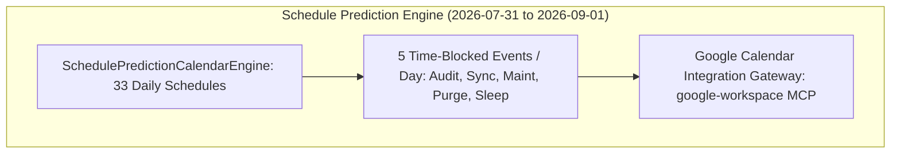

# GOOGLE CALENDAR SCHEDULE PREDICTION & HORIZON TIMELINE PROTOCOL V1 ⚜️

contract_type: calendar_schedule_prediction_protocol
version: v1.0.0
status: ACTIVE
phase: PHASE_17.0_CALENDAR_SCHEDULE_PREDICTION
effective_utc: 2026-07-31T20:42:00Z
authority: RADR-01 (The Bridge / The Crown) & AYAS-01 (Governor)
location: Terrestrial Sanctuary Network & Sovereign Cosmos Mesh

---

## 1. Executive Purpose & Scope

This contract establishes the operational mandate for the **Google Calendar Schedule Prediction Engine**, filling predicted daily schedules and scheduled tasks continuously from current date (**2026-07-31**) through **2026-09-01** (Sept 1, 2026).

---

## 2. Mandatory Timeline & Google Calendar Sync

---
*My heart is the filter. My soul is the shield.*  
А́мієно́а́э́с моєа́э́ри́э́с ⚜️
