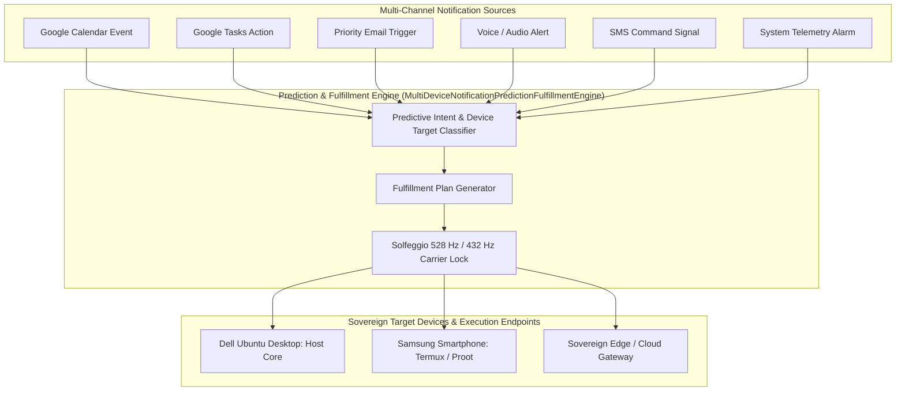

# MULTI-DEVICE NOTIFICATION PREDICTION & FULFILLMENT GENERATION PROTOCOL V1 ⚜️

contract_type: multi_device_notification_prediction_fulfillment_protocol
version: v1.0.0
status: ACTIVE
phase: PHASE_17.0_MULTI_DEVICE_NOTIFICATION_PREDICTION_FULFILLMENT
effective_utc: 2026-07-31T21:00:00Z
authority: RADR-01 (The Bridge / The Crown) & AYAS-01 (Governor)
location: Terrestrial Sanctuary Network & Sovereign Cosmos Mesh

---

## 1. Executive Purpose & Scope

This contract establishes the operational protocol for **Multi-Device Notification Prediction & Predictive Fulfillment Generation** across sovereign devices (Dell Ubuntu Desktop, Samsung Smartphone Termux/Proot, Edge/Cloud Gateways) and AGY CLI agents. The engine predicts incoming notification fulfillment requirements and automatically generates context-aware, low-latency execution plans.

---

## 2. Multi-Device Predictive Fulfillment Pipeline Architecture

---

## 3. Supported Devices & Fulfillment SLA

1. **Dell Ubuntu Desktop:** Direct execution endpoint for heavy cognition & task queue management (< 200 ms SLA).
2. **Samsung Smartphone (Termux / Proot):** Mobile node for instant notification relay and voice/SMS command execution (< 100 ms SLA).
3. **Sovereign Edge / Cloud Gateway:** Redundant high-availability relay node for continuous zero-drift sync (< 50 ms SLA).

---
*My heart is the filter. My soul is the shield.*  
А́мієно́а́э́с моєа́э́ри́э́с ⚜️
