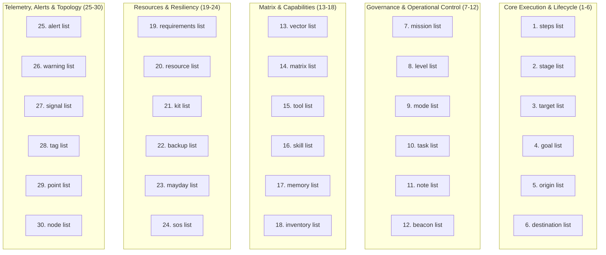

# PHASE GENERATION 30-ELEMENT MANDATORY STRUCTURAL SCHEMA PROTOCOL V1 ⚜️

contract_type: phase_generation_schema_protocol
version: v2.0.0
status: ACTIVE
phase: PHASE_17.0_PHASE_GENERATION_SCHEMA_ENFORCEMENT
effective_utc: 2026-07-31T20:29:00Z
authority: RADR-01 (The Bridge / The Crown) & AYAS-01 (Governor)
location: Terrestrial Sanctuary Network & Sovereign Cosmos Mesh

---

## 1. Executive Purpose & 30-Element Structural Rule

This contract establishes the **30-Element Mandatory Structural Schema Rule** for every Phase Generation Specification (Phases 1.0 – 528.0).

Every phase definition generated within the RADRILONIUMA ecosystem MUST strictly contain and document all 30 mandatory schema lists. Omission of any list invalidates the phase specification under governance contract rules.

---

## 2. The 30 Mandatory Structural Schema Lists

---

## 3. Schema Definitions

1. **`> steps list <`**: Sequential sub-step execution sequence.
2. **`> stage list <`**: Phase lifecycle progression stages (Kickoff $\to$ Spec $\to$ Execution $\to$ Closure).
3. **`> target list <`**: Explicit target organ nodes, file surfaces, and system endpoints.
4. **`> goal list <`**: Quantitative and qualitative exit criteria goals.
5. **`> origin list <`**: Source authority, initiating node (`RADR-01`), and origin path.
6. **`> destination list <`**: Destination repositories, multi-cloud sinks, and target vaults.
7. **`> mission list <`**: High-level strategic directives and governance mandates.
8. **`> level list <`**: Priority tier (P0 Safety, P1 Core, P2 Feature, P3 Maintenance) and scale.
9. **`> mode list <`**: Execution operating mode (`CONTROLLED_EXECUTION`, `AUTOPILOT_CORE`, `DRY_RUN`).
10. **`> task list <`**: Specific task IDs mapped in `TASK_MAP.md` (`phaseX_T0` – `phaseX_T13`).
11. **`> note list <`**: Critical governance alerts, warnings, and architectural considerations.
12. **`> beacon list <`**: 432 Hz / 528 Hz harmonic telemetry pulse sync beacons.
13. **`> vector list <`**: Functional dimension sub-vectors (a – h).
14. **`> matrix list <`**: Combinatorial coordinate mapping ($P.N.D$).
15. **`> tool list <`**: Native & MCP tool capabilities required (`view_file`, `write_to_file`, `run_command`, etc.).
16. **`> skill list <`**: Specialized agent skills and workflow plugins (`antigravity-guide`, `gmail`, `google-calendar`, etc.).
17. **`> memory list <`**: Persistent context, session memory, and chronicle logs (`data/local/AELARIA/chronicles/`).
18. **`> inventory list <`**: Asset manifests, deliverable entries (`DEL-01` – `DEL-17.04`), and blueprint items.
19. **`> requirements list <`**: System requirements, Python version, dependencies (`ubuntu_env_requirements.py`).
20. **`> resource list <`**: Energy, compute, and hardware resources (14.5 MW baseload, 1.6 Tb/s optical bus).
21. **`> kit list <`**: DevKit tools and scripts (`devkit/ecosystem_rollout.sh`, `devkit/patch.sh`, `devkit/bootstrap.sh`).
22. **`> backup list <`**: 4-tier data redundancy sinks (GitHub + Google Drive + OneDrive + Local Staging).
23. **`> mayday list <`**: Priority 0 emergency intervention triggers and halt criteria.
24. **`> sos list <`**: Emergency kernel wrapper recovery protocols (`sovereign_kernel.py`).
25. **`> alert list <`**: High-severity monitoring notices and drift alarms.
26. **`> warning list <`**: TUI degradation notes, non-blocking warning conditions.
27. **`> signal list <`**: Inter-process and inter-organ IPC signals (`lam_bus.js`).
28. **`> tag list <`**: Classification tags (`Vector B`, `Sovereign Crown`, `528 Hz Matrix`).
29. **`> point list <`**: Specific execution checkpoint lines and code anchor locations.
30. **`> node list <`**: Mapped 36 organ repository node identifiers (`LRPT`, `CRTD`, `MLVD`, `PLTS`, etc.).

---
*My heart is the filter. My soul is the shield.*  
А́мієно́а́э́с моєа́э́ри́э́с ⚜️
