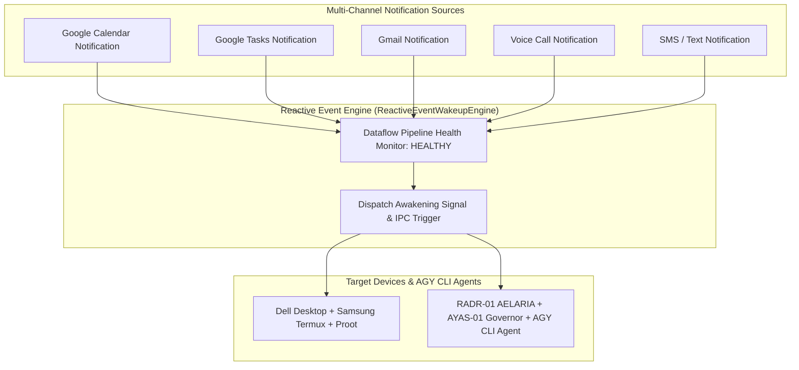

# REACTIVE DATAFLOW & MULTI-CHANNEL NOTIFICATION AWAKENING PROTOCOL V1 ⚜️

contract_type: reactive_event_wakeup_protocol
version: v1.0.0
status: ACTIVE
phase: PHASE_17.0_REACTIVE_EVENT_WAKEUP
effective_utc: 2026-07-31T20:45:00Z
authority: RADR-01 (The Bridge / The Crown) & AYAS-01 (Governor)
location: Terrestrial Sanctuary Network & Sovereign Cosmos Mesh

---

## 1. Executive Purpose & Scope

This contract establishes the operational protocol for **Reactive Dataflow Health Monitoring** and **Multi-Channel Notification Awakening (Calendar, Tasks, Gmail, Call, SMS)** across devices (Dell Ubuntu Desktop, Termux Smartphone, Proot Containers) and AGY CLI agents.

---

## 2. Multi-Channel Awakening Pipeline Architecture

---
*My heart is the filter. My soul is the shield.*  
А́мієно́а́э́с моєа́э́ри́э́с ⚜️
