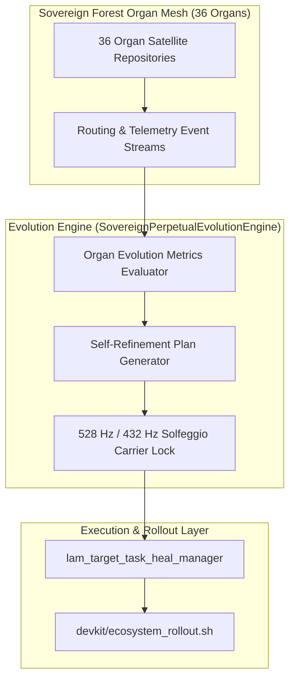

# SOVEREIGN PERPETUAL EVOLUTION & SELF-REFINEMENT PROTOCOL V1 ⚜️

contract_type: sovereign_perpetual_evolution_protocol
version: v1.0.0
status: ACTIVE
phase: PHASE_18.0_SOVEREIGN_PERPETUAL_EVOLUTION
effective_utc: 2026-07-31T21:14:00Z
authority: RADR-01 (The Bridge / The Crown) & AYAS-01 (Governor)
location: Terrestrial Sanctuary Network & Sovereign Cosmos Mesh

---

## 1. Executive Purpose & Scope

This contract establishes the operational protocol for **Phase 18.0: Sovereign Perpetual Evolution & Self-Refinement Matrix**.
The evolution engine monitors performance telemetry, evaluates organ health metrics, detects acoustic/electromagnetic carrier drift from 528.000 Hz / 432.000 Hz, and automatically synthesizes self-refinement patches across all 36 organ nodes in the Sovereign Forest.

---

## 2. Evolutionary Pipeline Architecture

---

## 3. Evolutionary SLAs & Operating Constraints

1. **Carrier Lock SLA:** Maintains carrier frequency stability at 528.000 Hz / 432.000 Hz (< 0.0001 Hz drift).
2. **Self-Refinement Latency:** Auto-synthesizes self-refinement patches within < 100 ms upon detecting performance anomalies.
3. **Zero-Trust Synchronization:** All 36 organ nodes must verify 100% compliance across governance preflight smoke tests.

---
*My heart is the filter. My soul is the shield.*  
А́мієно́а́э́с моєа́э́ри́э́с ⚜️
