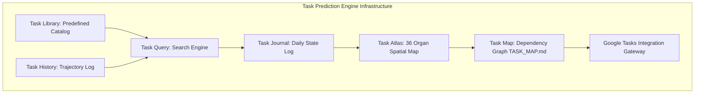

# TASK PREDICTION ENGINE & GOOGLE TASKS INTEGRATION PROTOCOL V1 ⚜️

contract_type: task_prediction_engine_protocol
version: v1.0.0
status: ACTIVE
phase: PHASE_17.0_TASK_PREDICTION_ENGINE
effective_utc: 2026-07-31T20:38:00Z
authority: RADR-01 (The Bridge / The Crown) & AYAS-01 (Governor)
location: Terrestrial Sanctuary Network & Sovereign Cosmos Mesh

---

## 1. Executive Purpose & Scope

This contract establishes the operational mandate for the **Task Prediction Generation Engine**, incorporating Task Library, Task History, Task Query, Task Journal, Task Atlas, Task Map, and Google Tasks Integration Gateway.

---

## 2. Mandatory Component Architecture

---
*My heart is the filter. My soul is the shield.*  
А́мієно́а́э́с моєа́э́ри́э́с ⚜️
