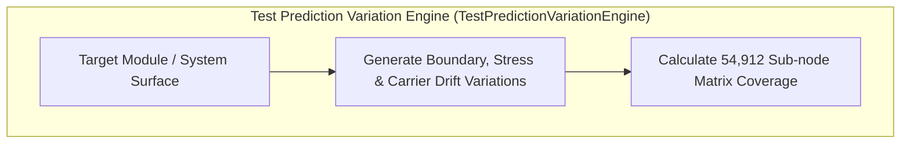

# TEST PREDICTION VARIATION & EXPANDING MATRIX PROTOCOL V1 ⚜️

contract_type: test_prediction_variation_protocol
version: v1.0.0
status: ACTIVE
phase: PHASE_17.0_TEST_PREDICTION_VARIATION
effective_utc: 2026-07-31T20:48:00Z
authority: RADR-01 (The Bridge / The Crown) & AYAS-01 (Governor)
location: Terrestrial Sanctuary Network & Sovereign Cosmos Mesh

---

## 1. Executive Purpose & Scope

This contract establishes the operational protocol for the **Test Prediction Variation Autopilot Expanding Engine Matrix**, predicting test boundary conditions, stress permutations, and carrier frequency drift scenarios across all 36 organ nodes and 54,912 combinatorial sub-nodes.

---

## 2. Expanding Test Matrix Architecture

---
*My heart is the filter. My soul is the shield.*  
А́мієно́а́э́с моєа́э́ри́э́с ⚜️
