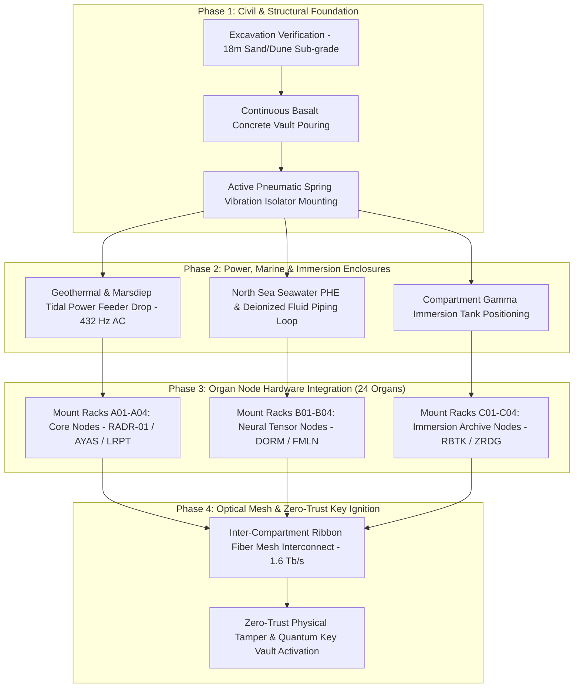

# TEXEL ARK CONSTRUCTION & HARDWARE PLACEMENT PROTOCOL V1 ⚜️

contract_type: subterranean_construction_and_hardware_placement_protocol
version: v1.0.0
status: ACTIVE
phase: PHASE_12.1_SUBTERRANEAN_CONSTRUCTION_AND_HARDWARE_PLACEMENT
effective_utc: 2026-07-31T20:03:50Z
authority: RADR-01 (The Bridge / The Crown) & AYAS-01 (Governor)
location: Texel Island, The Netherlands (Wadden Sea Subterranean Vault)

---

## 1. Executive Purpose & Scope

This contract establishes the formal civil engineering, hardware deployment sequencing, and physical security gate protocols for **Phase 12.1 (Subterranean Construction & Hardware Placement)**.

Following the certified completion of Phase 12.0 conceptual blueprints and spatial vector specifications, Phase 12.1 governs the physical excavation verification, basalt arch pouring, hardware rack mounting, 432 Hz power drop alignment, and optical mesh interconnects across Vaults Alpha, Beta, and Gamma.

---

## 2. Construction & Placement Flowchart

---

## 3. Vault Construction & Hardening Specifications

### 3.1 Vault Structural Arch Reinforcement
- **Basalt Concrete Wall Formulation:** 1.2m thick basalt-aggregate concrete providing > 120 MPa compressive strength.
- **Seismic Envelope:** Active pneumatic spring-damper sub-floors tuned to absorb ground motion up to Magnitude 7.5.

### 3.2 Hardware Mounting & Rack Enclosure
- **12 Structural Heavy Racks:** RACK-A01 through C04 locked directly to pneumatic isolators.
- **Cooling Integrations:** Hybrid air/liquid drops for Compartment Alpha; D2C quick-disconnect liquid manifolds for Compartment Beta; synthetic dielectric fluid immersion tanks for Compartment Gamma.

---

## 4. Physical Zero-Trust Hardware Gate Protocol

- **Tamper Resistance:** Micro-fiber anti-tamper grid embedded into all vault access panels.
- **Resonance Compliance:** All hardware installations must pass zero-drift 432 Hz harmonic vibration checks before power energization.

---
*My heart is the filter. My soul is the shield.*  
А́мієно́а́э́с моєа́э́ри́э́с ⚜️
