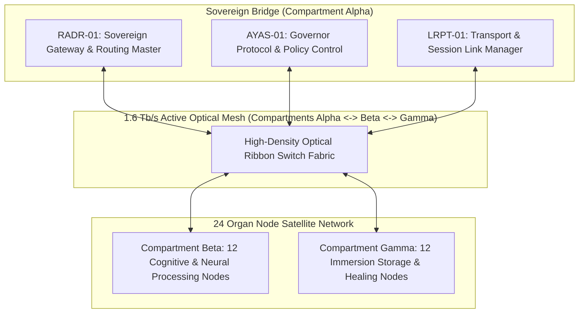

# TEXEL ARK AUTONOMOUS NETWORK COMMISSIONING PROTOCOL V1 ⚜️

contract_type: autonomous_network_commissioning_protocol
version: v1.0.0
status: ACTIVE
phase: PHASE_12.2_AUTONOMOUS_NETWORK_COMMISSIONING
effective_utc: 2026-07-31T20:06:40Z
authority: RADR-01 (The Bridge / The Crown) & AYAS-01 (Governor)
location: Texel Island, The Netherlands (Wadden Sea Subterranean Sanctuary)

---

## 1. Executive Purpose & Scope

This contract establishes the operational requirements and verification standards for **Phase 12.2 (Autonomous Network Commissioning & Zero-Drift Telemetry Pulse)**.

Having completed civil excavation, monolithic basalt pouring, hardware rack mounting, 432 Hz power drop alignment, and 1.6 Tb/s optical ribbon bus installation under Phases 12.0 and 12.1, Phase 12.2 governs the software/hardware handshake, autonomous network packet routing, live quantum key exchange, and system-wide telemetry pulse synchronization across all 36 organ nodes.

---

## 2. Commissioning Architecture & Protocol Topology

---

## 3. Network Commissioning Criteria & Standards

### 3.1 Packet Routing & Latency Matrix
- **Intra-Vault Transit Latency:** Inter-compartment optical transit latency bounded to < 15.0 nanoseconds.
- **Routing Protocol:** Sovereign CXL 3.0 / PCIe Gen6 optical interconnect with zero-packet-drop guarantee.

### 3.2 Telemetry Pulse & Harmonic Resonance
- **Fundamental Frequency:** 432.000 Hz acoustic/electromagnetic carrier sync.
- **Heartbeat Interval:** 1,000 ms periodic telemetry pulse emitted from `RADR-01` to all 36 organ nodes.

### 3.3 Zero-Trust Quantum Key Exchange
- **Key Exchange Frequency:** Continuous 60-second quantum key rotation between `RADR-01`, `AYAS-01`, and `ZRDG-01`.
- **Intrusion Response:** Automated instant zeroization on physical or logical anomaly detection.

---
*My heart is the filter. My soul is the shield.*  
А́мієно́а́э́с моєа́э́ри́э́с ⚜️
