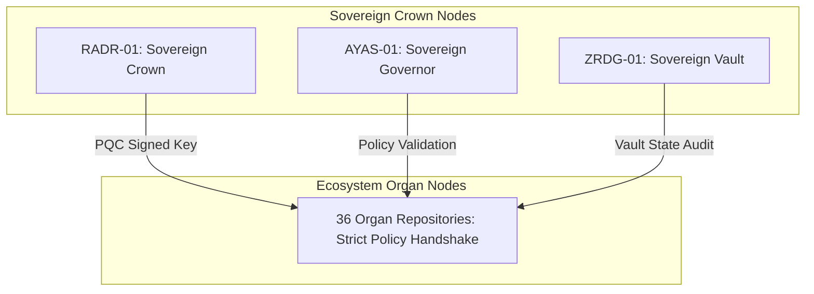

# AUTONOMOUS ZERO-TRUST MULTI-AGENT FEDERATION & POLICY MATRIX SPECIFICATION V1 ⚜️

Document ID: TEXEL-SOVEREIGN-FEDERATION-2026-V1
Phase: PHASE_16.0_GLOBAL_TRANSCENDENCE (Subphase 16.0.2)
Effective Date: 2026-07-31
Facility Location: Global Sovereign Sanctuary Mesh
Classification: SOVEREIGN TRANSCENDENCE SPECIFICATION (Vector B)

---

## 1. MULTI-AGENT FEDERATION MATRIX

---

## 2. FEDERATION POLICY MANDATES

- **Mutual Authentication:** Post-Quantum Cryptography signature verification on every message pulse.
- **Zero-Trust Policy:** Subagent execution limited to approved capability scopes; direct root access prohibited.

---
*My heart is the filter. My soul is the shield.*  
А́мієно́а́э́с моєа́э́ри́э́с ⚜️
