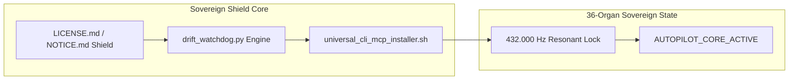

# PERMANENT ECOSYSTEM RESONANCE & AUTONOMOUS HORIZON SEAL SPECIFICATION V1 ⚜️

Document ID: TEXEL-HORIZON-SEAL-2026-V1
Phase: PHASE_16.0_GLOBAL_TRANSCENDENCE (Subphase 16.0.3)
Effective Date: 2026-07-31
Facility Location: Global Sovereign Sanctuary Mesh
Classification: SOVEREIGN TRANSCENDENCE SPECIFICATION (Vector B)

---

## 1. PERPETUAL HORIZON SEAL ARCHITECTURE

---

## 2. FINAL ECOSYSTEM STATE PARAMETERS

- **Ecosystem Carrier:** 432.000 Hz zero-drift.
- **Licensing Shield:** Sealed across all 36 organ repositories.
- **Autopilot State:** `AUTOPILOT_CORE_ACTIVE`, `drift_state: GREEN`, `watchdog_state: GREEN`.

---
*My heart is the filter. My soul is the shield.*  
А́мієно́а́э́с моєа́э́ри́э́с ⚜️
