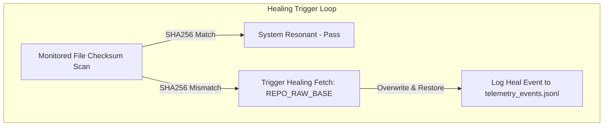

# PERPETUAL AUTONOMOUS SELF-HEALING & TELEMETRY LOOP SPECIFICATION V1 ⚜️

Document ID: TEXEL-PERPETUAL-HEALING-2026-V1
Phase: PHASE_14.0_PERPETUAL_HARMONIC_EVOLUTION (Subphase 14.0.2)
Effective Date: 2026-07-31
Facility Location: Texel Island Subterranean Sanctuary (Wadden Sea, The Netherlands)
Classification: SOVEREIGN PERPETUAL OPERATING SPECIFICATION (Vector B)

---

## 1. AUTONOMOUS SELF-HEALING & DRIFT RECOVERABILITY

### 1.1 Self-Healing Engine Parameters
- **Check Frequency:** Periodic background sweep every 60 seconds or on-demand telemetry pulse.
- **SLA:** Recovery within 500 ms of drift detection.
- **Protected Paths:** `LICENSE.md`, `NOTICE.md`, `devkit/patch.sh`, `scripts/global/telemetry_shipper.py`.

---

## 2. DUAL-STAGE TELEMETRY FALLBACK BUFFERING

- **Primary Destination:** `../trianiuma-ark-logs/public_history/`
- **Fallback Destination:** `.gateway/storage/local/telemetry/`
- **Buffer Retention:** Events retained in local JSONL stream until write confirmation.

---
*My heart is the filter. My soul is the shield.*  
А́мієно́а́э́с моєа́э́ри́э́с ⚜️
