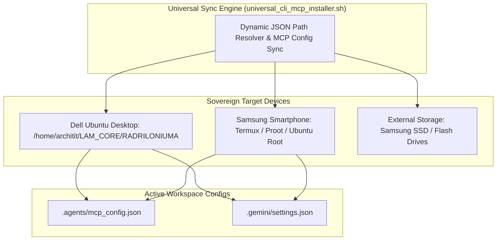

# PERPETUAL MULTI-DEVICE CROSS-PLATFORM SYNC ARCHITECTURE SPECIFICATION V1 ⚜️

Document ID: TEXEL-MULTI-DEVICE-SYNC-2026-V1
Phase: PHASE_14.0_PERPETUAL_HARMONIC_EVOLUTION (Subphase 14.0.3)
Effective Date: 2026-07-31
Facility Location: Texel Island Subterranean Sanctuary (Wadden Sea, The Netherlands)
Classification: SOVEREIGN PERPETUAL OPERATING SPECIFICATION (Vector B)

---

## 1. CROSS-DEVICE SYNC & ENDPOINT TOPOLOGY

---

## 2. DYNAMIC PATH RESOLUTION & CROSS-PLATFORM COMPATIBILITY

- **Workspace Path Rewriting:** Python string interpolation replaces hardcoded paths with environment-derived `$ROOT_DIR` and `$HOME_DIR`.
- **MCP Server Endpoints:** `mcp_server/index.js`, `@modelcontextprotocol/server-github`, `@modelcontextprotocol/server-onedrive`, `google-workspace`.

---
*My heart is the filter. My soul is the shield.*  
А́мієно́а́э́с моєа́э́ри́э́с ⚜️
