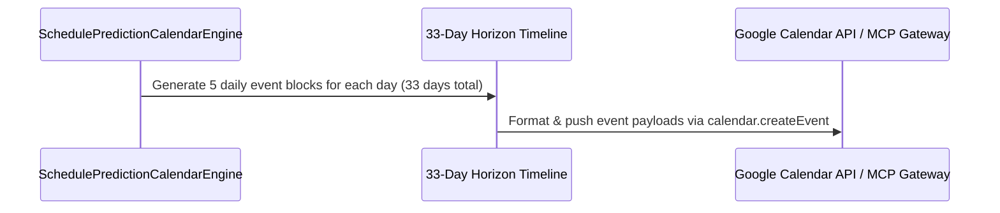

# SOVEREIGN GOOGLE CALENDAR SCHEDULE PREDICTION SPECIFICATION V1 ⚜️

Document ID: TEXEL-CALENDAR-PREDICTION-2026-V1
Phase: PHASE_17.0_CALENDAR_SCHEDULE_PREDICTION
Effective Date: 2026-07-31
Facility Location: Texel Sanctuary Hub & Sovereign Cosmos Mesh
Classification: SOVEREIGN SPECIFICATION (Vector B)

---

## 1. HORIZON CALENDAR TIMELINE MATRIX (2026-07-31 to 2026-09-01)

---

## 2. DAILY EVENT TEMPLATE BLOCKS

1. **08:00 - 09:00 UTC:** 432 Hz Morning Sanctuary Audit (`LRPT`).
2. **10:00 - 12:00 UTC:** Quantum Key & Telemetry Pulse Sync (`ZRDG-01`).
3. **14:00 - 16:00 UTC:** Subterranean Vault & Optical Bus Maintenance (`VLRM`).
4. **18:00 - 18:30 UTC:** Daily Trash Purge & Cache Wipe (`cleaner`).
5. **23:00 - 07:00 UTC:** Circadian Rest & Recovery Window (`sleep_engine`).

---
*My heart is the filter. My soul is the shield.*  
А́мієно́а́э́с моєа́э́ри́э́с ⚜️
