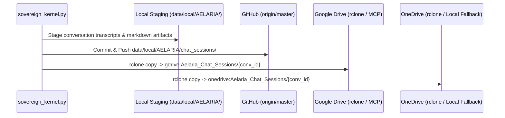

# SOVEREIGN COSMOS MULTI-CLOUD REDUNDANT BACKUP & SESSION ARCHIVING SPECIFICATION V1 ⚜️

Document ID: TEXEL-COSMOS-ARCHIVE-2026-V1
Phase: PHASE_15.0_SOVEREIGN_ARK_COSMOS_EXPANSION (Subphase 15.0.2)
Effective Date: 2026-07-31
Facility Location: Texel Island Subterranean Sanctuary & Cosmos Cloud Endpoints
Classification: SOVEREIGN COSMOS ARCHITECTURE SPECIFICATION (Vector B)

---

## 1. 4-TIER SESSION DATA ARCHIVING ARCHITECTURE

---

## 2. RECOVERY & FALLBACK VERIFICATION

- **Primary Cloud Storage:** GitHub master repository versioning.
- **Secondary Cloud Storage:** Google Drive & Microsoft OneDrive `rclone` / MCP gateway sync.
- **Local Fallback:** Permanent subterranean disk staging in `data/local/AELARIA/chat_sessions/`.

---
*My heart is the filter. My soul is the shield.*  
А́мієно́а́э́с моєа́э́ри́э́с ⚜️
