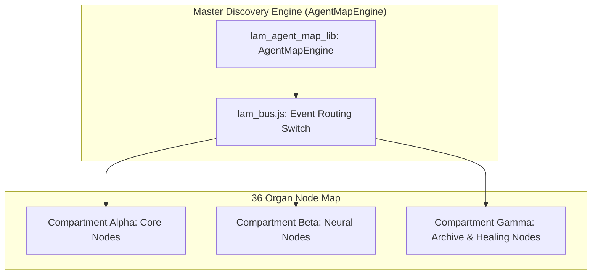

# SOVEREIGN COSMOS AUTONOMOUS NODE DISCOVERY & EDGE GATEWAY ROUTING SPECIFICATION V1 ⚜️

Document ID: TEXEL-COSMOS-DISCOVERY-2026-V1
Phase: PHASE_15.0_SOVEREIGN_ARK_COSMOS_EXPANSION (Subphase 15.0.3)
Effective Date: 2026-07-31
Facility Location: Texel Island Subterranean Sanctuary & Edge Gateways
Classification: SOVEREIGN COSMOS ARCHITECTURE SPECIFICATION (Vector B)

---

## 1. 36-ORGAN AUTONOMOUS DISCOVERY & EDGE GATEWAY TOPOLOGY

---

## 2. NODE DISCOVERY & TELEMETRY SYNC PARAMETERS

- **Topology Mapping:** Verified 36 organ nodes synchronized at 432 Hz resonance.
- **IPC Protocol:** Standardized `lam_bus.js` message routing across subprocesses and edge gateways.

---
*My heart is the filter. My soul is the shield.*  
А́мієно́а́э́с моєа́э́ри́э́с ⚜️
