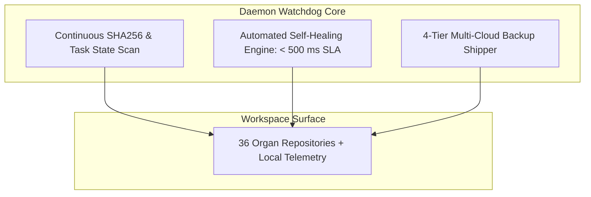

# AUTONOMOUS DAEMON FULFILLMENT WATCHDOG LOOP SPECIFICATION V1 ⚜️

Document ID: TEXEL-DAEMON-WATCHDOG-2026-V1
Phase: PHASE_17.0_SOVEREIGN_HORIZON_528_MATRIX_INIT (Subphase 17.0.3)
Effective Date: 2026-07-31
Facility Location: Texel Sanctuary Hub & Sovereign Cosmos Mesh
Classification: SOVEREIGN 528 MATRIX SPECIFICATION (Vector B)

---

## 1. DAEMON FULFILLMENT WATCHDOG ARCHITECTURE

---

## 2. WATCHDOG FULFILLMENT MANDATES

- **Continuous Sweeping:** Watchdog daemons maintain non-blocking monitoring of task logs and repository checksums.
- **Auto-Healing:** Automatic file repair within < 500 ms upon detection of unauthorized drift.

---
*My heart is the filter. My soul is the shield.*  
А́мієно́а́э́с моєа́э́ри́э́с ⚜️
