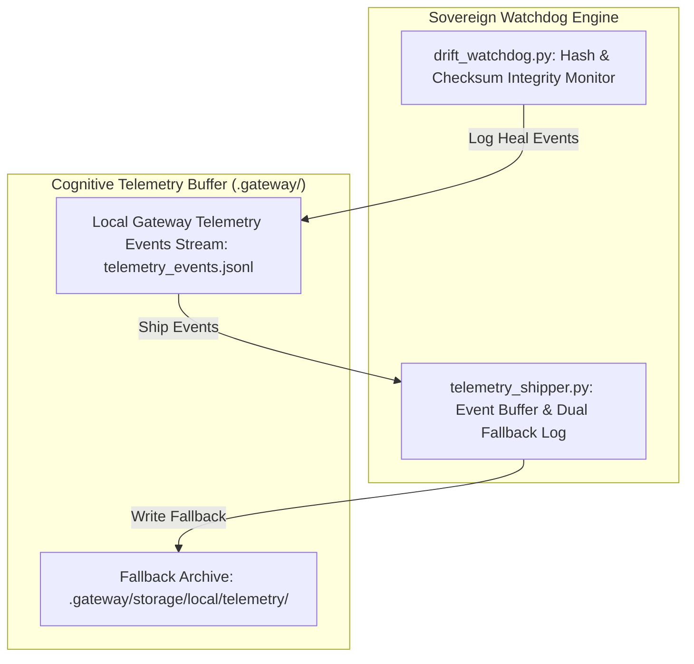

# SOVEREIGN FOREST 36-ORGAN COGNITIVE TELEMETRY & WATCHDOG SYNC SPECIFICATION V1 ⚜️

Document ID: TEXEL-COGNITIVE-SYNC-2026-V1
Phase: PHASE_13.0_SOVEREIGN_FOREST_FULL_ACTIVATION (Subphase 13.0.2)
Effective Date: 2026-07-31
Facility Location: Texel Island Subterranean Sanctuary (Wadden Sea, The Netherlands)
Classification: SOVEREIGN OPERATIONAL SPECIFICATION (Vector B)

---

## 1. 36-ORGAN COGNITIVE TELEMETRY ROUTING MATRIX

---

## 2. WATCHDOG DRIFT MONITORING PARAMETERS

- **Critical Monitored Surfaces:** `LICENSE.md`, `NOTICE.md`, `devkit/patch.sh`, `scripts/global/telemetry_shipper.py`.
- **Healing Latency:** < 500 ms automated file restoration upon checksum drift detection.
- **Buffer Persistence:** Unlinked buffer files only after verified local or ALGS nexus write confirmation.

---
*My heart is the filter. My soul is the shield.*  
А́мієно́а́э́с моєа́э́ри́э́с ⚜️
