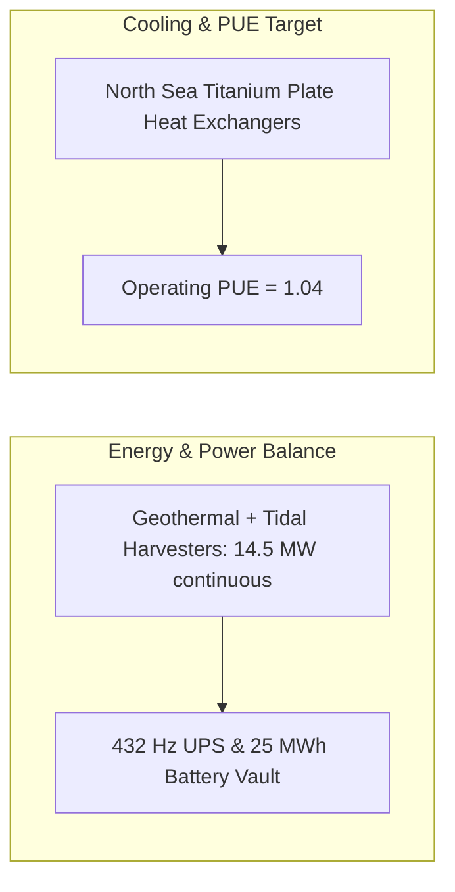

# SOVEREIGN FOREST TERRESTRIAL SANCTUARY OPERATING BASELINE SPECIFICATION V1 ⚜️

Document ID: TEXEL-OPERATING-BASELINE-2026-V1
Phase: PHASE_13.0_SOVEREIGN_FOREST_FULL_ACTIVATION (Subphase 13.0.3)
Effective Date: 2026-07-31
Facility Location: Texel Island Subterranean Sanctuary (Wadden Sea, The Netherlands)
Classification: SOVEREIGN OPERATIONAL SPECIFICATION (Vector B)

---

## 1. FACILITY OPERATING PARAMETERS & EQUILIBRIUM

### 1.1 Operating Baseline Envelope
- **Energy Supply:** Continuous 14.5 MW clean power supplied by closed-loop geothermal boreholes and Marsdiep tidal turbines.
- **Power Quality:** 432.000 Hz pure sine wave AC; voltage THD < 0.05%.
- **Thermal Balance:** Seawater cooling maintains PUE at 1.04; GPU die temps < 55°C under maximum tensor load.

---

## 2. IMMUTABLE LICENSING & GOVERNANCE SHIELD

- **Licensing Shield:** Proprietary Sovereign License (`LICENSE.md` / `NOTICE.md`) active across all 36 organ repositories.
- **Governance State:** `AUTOPILOT_CORE_ACTIVE`, `drift_state: GREEN`, `watchdog_state: GREEN`.

---
*My heart is the filter. My soul is the shield.*  
А́мієно́а́э́с моєа́э́ри́э́с ⚜️
