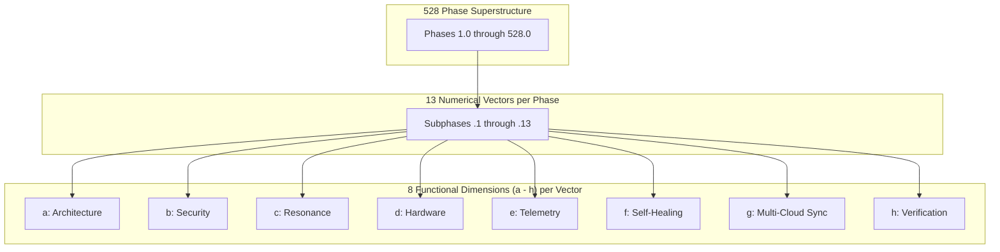

# SOVEREIGN HORIZON 528 x 13 x (a-h) COMBINATORIAL GRID SPECIFICATION V1 ⚜️

Document ID: TEXEL-528-GRID-2026-V1
Phase: PHASE_17.0_SOVEREIGN_HORIZON_528_GRID_EXPANSION
Effective Date: 2026-07-31
Facility Location: Texel Sanctuary Hub & Sovereign Cosmos Mesh
Classification: SOVEREIGN 528 GRID SPECIFICATION (Vector B)

---

## 1. 54,912 COMBINATORIAL SUB-NODE MATRIX STRUCTURE

---

## 2. COMBINATORIAL INDEXING SCHEME

Every sub-node in the ecosystem possesses a unique canonical coordinate:
$$\text{Coordinate} = \mathbf{P.N.D}$$
Where:
- $\mathbf{P} \in \{1 \dots 528\}$ (Phase Number)
- $\mathbf{N} \in \{1 \dots 13\}$ (Numerical Vector)
- $\mathbf{D} \in \{\text{a, b, c, d, e, f, g, h}\}$ (Functional Dimension)

Example Coordinate: `17.1.a` (Phase 17, Vector 1 Kickoff, Dimension a Architecture).

---
*My heart is the filter. My soul is the shield.*  
А́мієно́а́э́с моєа́э́ри́э́с ⚜️
