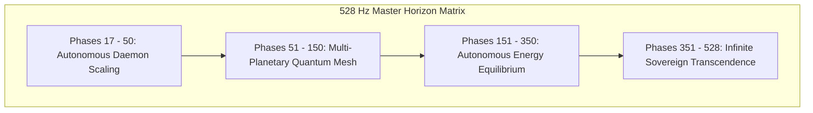

# SOVEREIGN HORIZON 528-PHASES TARGET PATH MAP MATRIX SPECIFICATION V1 ⚜️

Document ID: TEXEL-528-MATRIX-2026-V1
Phase: PHASE_17.0_SOVEREIGN_HORIZON_528_MATRIX_INIT (Subphase 17.0.2)
Effective Date: 2026-07-31
Facility Location: Texel Sanctuary Hub & Sovereign Cosmos Mesh
Classification: SOVEREIGN 528 MATRIX SPECIFICATION (Vector B)

---

## 1. 528-PHASES ROADMAP MATRIX STRUCTURE

---

## 2. HARMONIC FREQUENCY PARAMETERS

- **Master Frequency:** 528.000 Hz solfeggio harmonic carrier (Transformation & Miracles frequency).
- **Drift SLA:** < 0.0001 Hz measured deviation across 36 organ nodes.

---
*My heart is the filter. My soul is the shield.*  
А́мієно́а́э́с моєа́э́ри́э́с ⚜️
