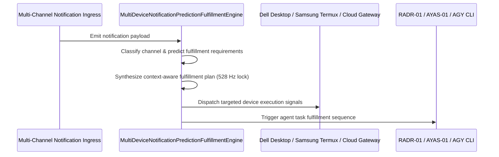

# SOVEREIGN MULTI-DEVICE NOTIFICATION PREDICTION & FULFILLMENT SPECIFICATION V1 ⚜️

Document ID: TEXEL-MULTI-DEVICE-NOTIFICATION-FULFILLMENT-2026-V1
Phase: PHASE_17.0_MULTI_DEVICE_NOTIFICATION_PREDICTION_FULFILLMENT
Effective Date: 2026-07-31
Facility Location: Texel Sanctuary Hub & Sovereign Cosmos Mesh
Classification: SOVEREIGN SPECIFICATION (Vector B)

---

## 1. PREDICTIVE NOTIFICATION FULFILLMENT MATRIX

---

## 2. NOTIFICATION CHANNELS & FULFILLMENT ACTIONS

1. **Calendar Notifications:** Predicts upcoming schedule constraints and pre-allocates agent compute windows.
2. **Tasks Notifications:** Auto-generates fulfillment task specs and enqueues to organ worker queues.
3. **Gmail Notifications:** Analyzes priority messages and formulates automated response drafts / execution triggers.
4. **Voice / Call Notifications:** Priority 0 emergency fulfillment with instant multi-device awakening broadcast.
5. **SMS / Text Notifications:** Parses command syntaxes and executes localized shell/script actions.
6. **System Alarms:** Auto-initiates self-healing diagnostic sweeps across all 36 organ nodes.

---
*My heart is the filter. My soul is the shield.*  
А́мієно́а́э́с моєа́э́ри́э́с ⚜️
