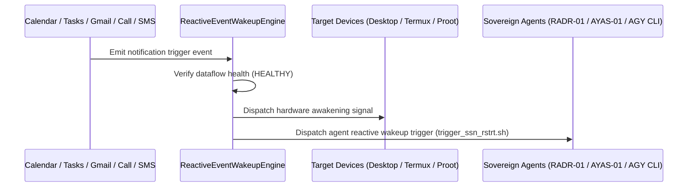

# SOVEREIGN REACTIVE DATAFLOW & NOTIFICATION AWAKENING SPECIFICATION V1 ⚜️

Document ID: TEXEL-REACTIVE-WAKEUP-2026-V1
Phase: PHASE_17.0_REACTIVE_EVENT_WAKEUP
Effective Date: 2026-07-31
Facility Location: Texel Sanctuary Hub & Sovereign Cosmos Mesh
Classification: SOVEREIGN SPECIFICATION (Vector B)

---

## 1. REACTIVE EVENT PIPELINE MATRIX

---

## 2. NOTIFICATION CHANNELS & AWAKENING TARGETS

1. **Google Calendar Notifications:** Triggers schedule synchronization and agent awakening.
2. **Google Tasks Notifications:** Triggers task queue processing and execution.
3. **Gmail Notifications:** Triggers priority email processing and command handling.
4. **Voice Call Notifications:** Triggers emergency priority 0 awakening sequence.
5. **SMS Notifications:** Triggers instant SMS command parsing and agent response.

---
*My heart is the filter. My soul is the shield.*  
А́мієно́а́э́с моєа́э́ри́э́с ⚜️
