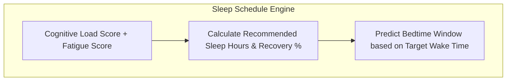
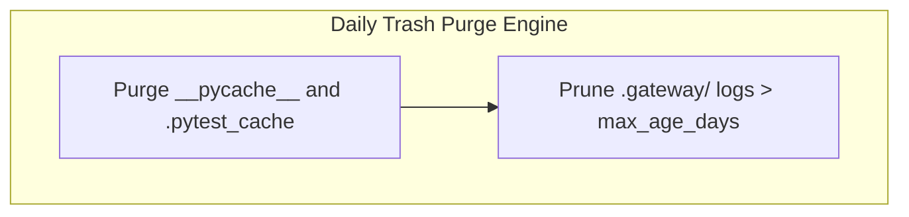

# DAILY SLEEP SCHEDULE PREDICTION & TRASH PURGE SPECIFICATION V1 ⚜️

Document ID: TEXEL-SLEEP-PURGE-2026-V1
Phase: PHASE_17.0_DAILY_MAINTENANCE_AND_SLEEP_SCHEDULE
Effective Date: 2026-07-31
Facility Location: Texel Sanctuary Hub & Sovereign Cosmos Mesh
Classification: SOVEREIGN MAINTENANCE SPECIFICATION (Vector B)

---

## 1. SLEEP SCHEDULE ENGINE & RECOVERY INDEX SPECIFICATION

---

## 2. DAILY TRASH PURGE & PRUNING SPECIFICATION

---
*My heart is the filter. My soul is the shield.*  
А́мієно́а́э́с моєа́э́ри́э́с ⚜️
