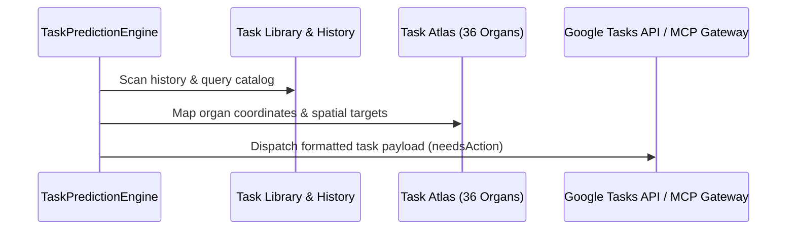

# SOVEREIGN TASK PREDICTION GENERATION ENGINE SPECIFICATION V1 ⚜️

Document ID: TEXEL-TASK-PREDICTION-2026-V1
Phase: PHASE_17.0_TASK_PREDICTION_ENGINE
Effective Date: 2026-07-31
Facility Location: Texel Sanctuary Hub & Sovereign Cosmos Mesh
Classification: SOVEREIGN SPECIFICATION (Vector B)

---

## 1. TASK PREDICTION & GOOGLE TASKS MATRIX

---

## 2. COMPONENT SPECIFICATIONS

1. **Task Library:** Pre-compiled catalog of system tasks (Audits, PQC rotations, Purges, Syncs).
2. **Task History:** Historical execution trajectory log.
3. **Task Query:** Keyword and category filtering engine.
4. **Task Journal:** Real-time event and state transition journal.
5. **Task Atlas:** Spatial mapping across 36 organ nodes across Compartments Alpha, Beta, and Gamma.
6. **Task Map:** Canonical dependency graph ([`TASK_MAP.md`](file:///home/architit/LAM_CORE/RADRILONIUMA/TASK_MAP.md)).
7. **Google Tasks Gateway:** JSON payload formatting and sync gateway with `google-workspace` MCP server.

---
*My heart is the filter. My soul is the shield.*  
А́мієно́а́э́с моєа́э́ри́э́с ⚜️
