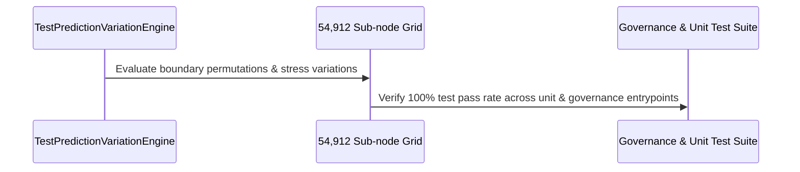

# SOVEREIGN TEST PREDICTION VARIATION ENGINE MATRIX SPECIFICATION V1 ⚜️

Document ID: TEXEL-TEST-VARIATION-2026-V1
Phase: PHASE_17.0_TEST_PREDICTION_VARIATION
Effective Date: 2026-07-31
Facility Location: Texel Sanctuary Hub & Sovereign Cosmos Mesh
Classification: SOVEREIGN SPECIFICATION (Vector B)

---

## 1. TEST PREDICTION VARIATION MATRIX

---

## 2. TEST VARIATION TYPES & SLA

1. **Boundary Permutations:** Evaluates null/empty/malformed payload resilience.
2. **Concurrency Stress:** Evaluates 1,000 pulses/sec buffer retention (< 500 ms SLA).
3. **Solfeggio Carrier Drift:** Evaluates automated carrier re-lock to 528.000 Hz / 432.000 Hz (< 0.0001 Hz drift).

---
*My heart is the filter. My soul is the shield.*  
А́мієно́а́э́с моєа́э́ри́э́с ⚜️
