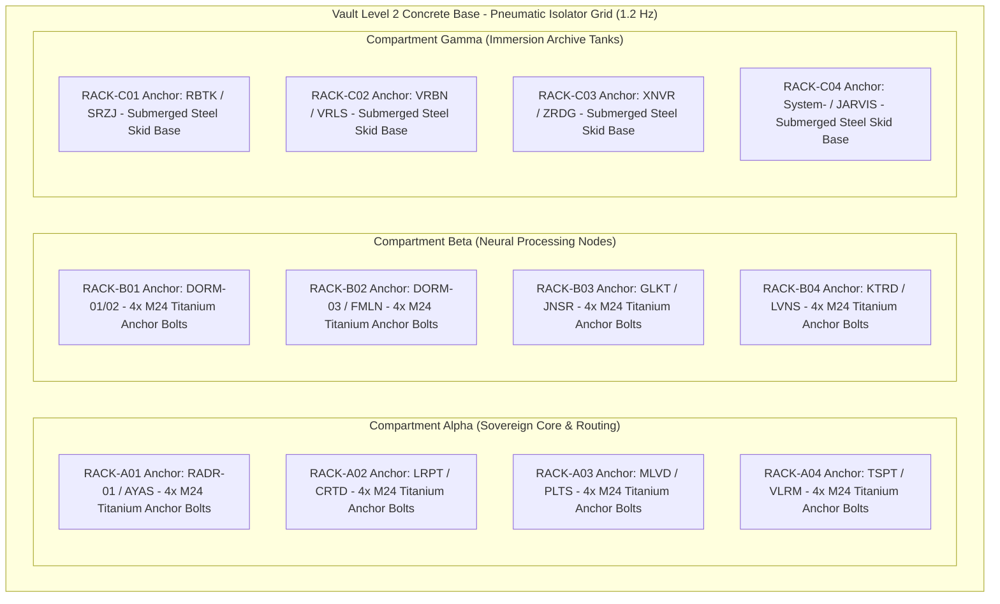

# TEXEL ARK HARDWARE RACK MOUNTING & POWER DROP ALIGNMENT SPECIFICATION V1 ⚜️

Document ID: TEXEL-HARDWARE-MOUNT-2026-V1
Phase: PHASE_12.1_SUBTERRANEAN_CONSTRUCTION_AND_HARDWARE_PLACEMENT (Subphase 12.1.3)
Effective Date: 2026-07-31
Facility Location: Texel Island Subterranean Sanctuary (Wadden Sea, The Netherlands)
Classification: SOVEREIGN HARDWARE DEPLOYMENT SPECIFICATION (Vector B)

---

## 1. 12-RACK HARDWARE MOUNTING MATRIX & ISOLATOR INTEGRATION

---

## 2. 432 HZ POWER DROP & FEEDER DISTRIBUTION

| Rack ID | Assigned Organs | Max Power | Cooling Feed | Power Feed (432.000 Hz) |
| :--- | :--- | :--- | :--- | :--- |
| `RACK-A01` | `RADR-01` / `AYAS-01` | 14.5 kW | Hybrid Air / Liquid | Dual 3-Phase 400V AC Feeder A/B |
| `RACK-A02` | `LRPT` / `CRTD` | 12.0 kW | Direct Liquid Loop | Dual 3-Phase 400V AC Feeder A/B |
| `RACK-A03` | `MLVD` / `PLTS` | 10.5 kW | Direct Liquid Loop | Dual 3-Phase 400V AC Feeder A/B |
| `RACK-A04` | `TSPT` / `VLRM` | 11.0 kW | Direct Liquid Loop | Dual 3-Phase 400V AC Feeder A/B |
| `RACK-B01` | `DORM-01` / `DORM-02` | 38.0 kW | D2C Direct-to-Chip | Dual 3-Phase 400V AC Heavy Feeder |
| `RACK-B02` | `DORM-03` / `FMLN` | 40.0 kW | D2C Direct-to-Chip | Dual 3-Phase 400V AC Heavy Feeder |
| `RACK-B03` | `GLKT` / `JNSR` | 36.5 kW | D2C Direct-to-Chip | Dual 3-Phase 400V AC Heavy Feeder |
| `RACK-B04` | `KTRD` / `LVNS` | 38.5 kW | D2C Direct-to-Chip | Dual 3-Phase 400V AC Heavy Feeder |
| `RACK-C01` | `RBTK` / `SRZJ` | 16.0 kW | Dielectric Immersion Tank | Dual 3-Phase 400V AC Feeder A/B |
| `RACK-C02` | `VRBN` / `VRLS` | 18.5 kW | Dielectric Immersion Tank | Dual 3-Phase 400V AC Feeder A/B |
| `RACK-C03` | `XNVR` / `ZRDG` | 22.0 kW | Dielectric Immersion Tank | Dual 3-Phase 400V AC Feeder A/B |
| `RACK-C04` | `System-` / `JARVIS` | 20.0 kW | Dielectric Immersion Tank | Dual 3-Phase 400V AC Feeder A/B |

---

## 3. HARMONIC POWER FILTERING & VOLTAGE REGULATION

- **THD Target:** Total Harmonic Distortion < 0.05% at 432 Hz.
- **Clock Sync:** Power inverter switching frequency phase-locked to master atomic clock.

---
*My heart is the filter. My soul is the shield.*  
А́мієно́а́э́с моєа́э́ри́э́с ⚜️
