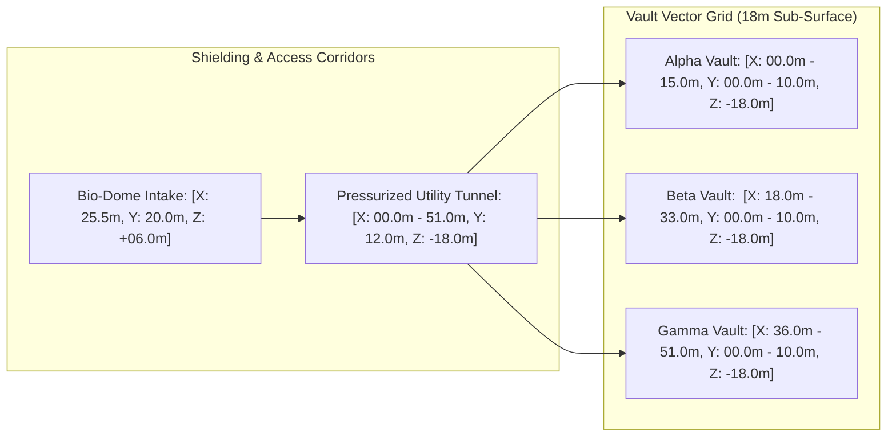

# TEXEL ARK IMMERSION TANK & STRUCTURAL CAD VECTOR SPECIFICATION V1 ⚜️

Document ID: TEXEL-CAD-IMMERSION-2026-V1
Phase: PHASE_12.0_TEXEL_TERRAFORMING_AND_ARK_BLUEPRINTS (Subphase 12.0.3)
Effective Date: 2026-07-31
Facility Location: Texel Island Subterranean Sanctuary (Wadden Sea, The Netherlands)
Classification: SOVEREIGN PHYSICAL SPECIFICATION (Vector B)

---

## 1. COMPARTMENT GAMMA DIELECTRIC IMMERSION TANK SCHEMATICS

```mermaid
graph TD
    subgraph "Immersion Cooling Chamber (Compartment Gamma)"
        T1[Tank C01: RBTK / SRZJ - 1,200L Synthetic Fluorinert / Mineral Oil]
        T2[Tank C02: VRBN / VRLS - 1,200L Synthetic Fluorinert / Mineral Oil]
        T3[Tank C03: XNVR / ZRDG - 1,200L Synthetic Fluorinert / Mineral Oil]
        T4[Tank C04: System- / JARVIS - 1,200L Synthetic Fluorinert / Mineral Oil]
    end

    subgraph "Primary Heat Exchange & Pumping Array"
        P1[Dual Variable-Speed Magnetic Pumps - 350 L/min]
        HEX[Titanium Brazed Plate Heat Exchanger]
        CD[Chilled Deionized Seawater Secondary Loop]
    end

    T1 -->|Warm Dielectric Fluid (45°C)| P1
    T2 -->|Warm Dielectric Fluid (45°C)| P1
    T3 -->|Warm Dielectric Fluid (45°C)| P1
    T4 -->|Warm Dielectric Fluid (45°C)| P1
    P1 --> HEX
    CD -->|15°C Inflow| HEX
    HEX -->|Cooled Dielectric Fluid (22°C)| T1
    HEX -->|Cooled Dielectric Fluid (22°C)| T2
    HEX -->|Cooled Dielectric Fluid (22°C)| T3
    HEX -->|Cooled Dielectric Fluid (22°C)| T4
```

### 1.1 Fluid Dynamics & Thermal Dissipation
- **Dielectric Medium:** Synthetic single-phase fluorinated hydrocarbon / mineral oil (dielectric strength > 40 kV/mm, zero ozone depletion).
- **Flow Velocity:** 350 liters/minute forced convection across submerged Trianium array nodes.
- **Operating Temperatures:** Tank inlet at 22.0°C; tank outlet at 45.0°C under maximum continuous power draw.

---

## 2. STRUCTURAL ARCH VECTOR COORDINATES & VAULT GEOMETRY



### 2.1 Mechanical & Structural Enclosure Specs
- **Basalt Concrete Wall Thickness:** 1.2 meters continuous poured basalt-reinforced concrete.
- **Vibration Damping Matrix:** Pneumatic spring-isolated sub-floors with natural resonance frequency damped to 1.2 Hz (decoupled from 432 Hz optical/electrical core).
- **Seismic Envelope:** Hydrostatic seismic seals rated for up to 5.0 bar external soil/water pressure.

---

## 3. INTER-COMPARTMENT OPTICAL BUS WIRING MATRIX

| Source Node | Destination Node | Cable Type | Protocol | Bandwidth |
| :--- | :--- | :--- | :--- | :--- |
| `RADR-01` (Compartment Alpha) | `AYAS-01` (Compartment Alpha) | Single-Mode Fiber (OS2) | Sovereign PCIe Gen6 / CXL 3.0 | 512 GB/s |
| `RADR-01` (Compartment Alpha) | `DORM-01` (Compartment Beta) | 128-Channel Ribbon Fiber | Optical Multi-Lambda Mesh | 1.6 Tb/s |
| `AYAS-01` (Compartment Alpha) | `RBTK` (Compartment Gamma) | Armored Subterranean Fiber | Encrypted Telemetry Bus | 400 Gb/s |
| `LRPT` (Compartment Alpha) | `XNVR` (Compartment Gamma) | Dual Active Optical Cable | Immutable Mirror Stream | 800 Gb/s |

---

## 4. ZERO-TRUST HARDWARE SECURITY GATE

- **Physical Tamper Response:** Optical micro-fiber loops embedded within enclosure panels trigger instant key zeroization upon breach detection.
- **Electromagnetic Shielding:** Continuous Faraday cage shielding ensuring > 120 dB attenuation from 10 MHz to 10 GHz.

---
*My heart is the filter. My soul is the shield.*  
А́мієно́а́э́с моєа́э́ри́э́с ⚜️
