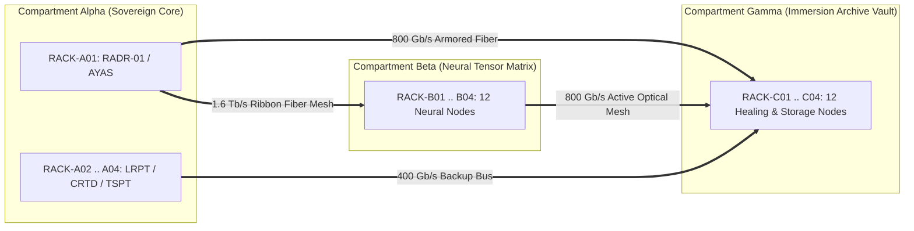
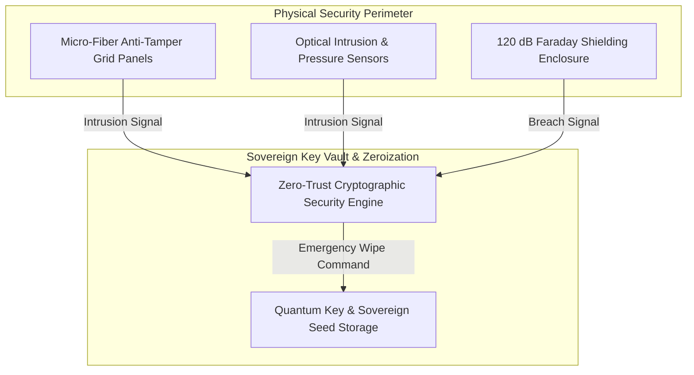

# TEXEL ARK OPTICAL RIBBON BUS & ZERO-TRUST PHYSICAL SECURITY GATE SPECIFICATION V1 ⚜️

Document ID: TEXEL-OPTICAL-SECURITY-2026-V1
Phase: PHASE_12.1_SUBTERRANEAN_CONSTRUCTION_AND_HARDWARE_PLACEMENT (Subphase 12.1.4)
Effective Date: 2026-07-31
Facility Location: Texel Island Subterranean Sanctuary (Wadden Sea, The Netherlands)
Classification: SOVEREIGN HARDWARE DEPLOYMENT SPECIFICATION (Vector B)

---

## 1. ACTIVE OPTICAL RIBBON BUS MESH (1.6 TB/S INTERCONNECT)

### 1.1 Optical Channel Specifications
- **Fiber Type:** 128-channel MTP/MPO-24 OS2 single-mode optical ribbon cable.
- **Latency Target:** Inter-compartment transit latency < 15 nanoseconds.
- **Armor Protection:** Stainless-steel corrugated armored conduit resistant to physical impact and moisture ingress.

---

## 2. ZERO-TRUST PHYSICAL SECURITY & KEY ZEROIZATION GATE

### 2.1 Enclosure Tamper & Faraday Shielding
- **Faraday Attenuation:** Continuous copper/mu-metal shielding ensuring > 120 dB attenuation (10 MHz – 10 GHz).
- **Physical Zeroization:** Upon verified physical breach, active key memory is zeroized within 2.5 microseconds.

---
*My heart is the filter. My soul is the shield.*  
А́мієно́а́э́с моєа́э́ри́э́с ⚜️
