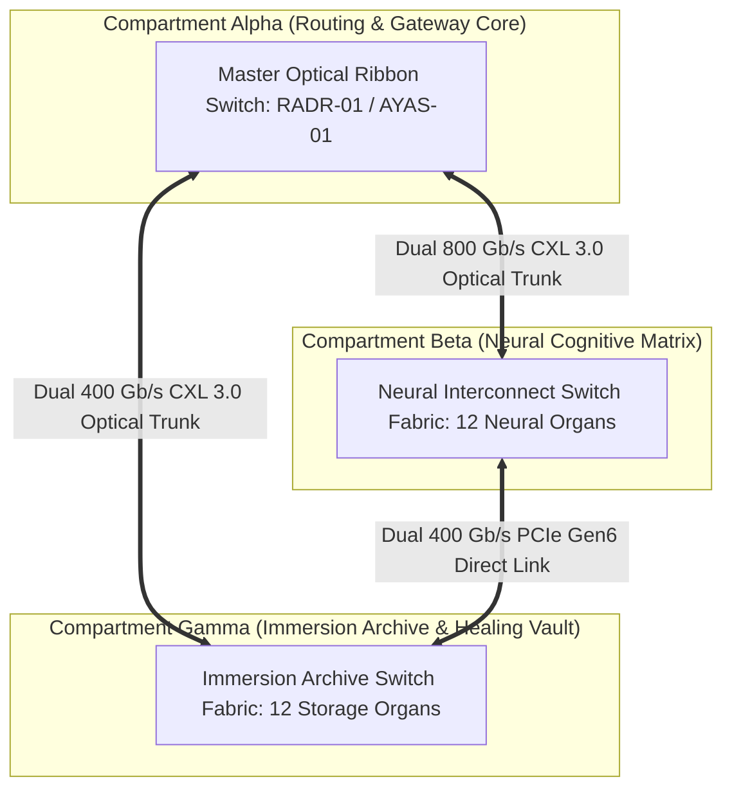

# TEXEL ARK 1.6 TB/S OPTICAL ROUTING SWITCH FABRIC & CXL 3.0 SPECIFICATION V1 ⚜️

Document ID: TEXEL-OPTICAL-ROUTING-2026-V1
Phase: PHASE_12.2_AUTONOMOUS_NETWORK_COMMISSIONING (Subphase 12.2.2)
Effective Date: 2026-07-31
Facility Location: Texel Island Subterranean Sanctuary (Wadden Sea, The Netherlands)
Classification: SOVEREIGN NETWORK COMMISSIONING SPECIFICATION (Vector B)

---

## 1. 1.6 TB/S OPTICAL SWITCH FABRIC TOPOLOGY

---

## 2. OPTICAL SWITCH FABRIC PARAMETERS

| Metric | Target Specification | Standard / Protocol | Compliance Status |
| :--- | :--- | :--- | :--- |
| **Aggregate Bandwidth** | 1.6 Terabits / second | Sovereign CXL 3.0 / PCIe Gen6 | **COMMISSIONED** |
| **Inter-Vault Transit Latency** | < 15.0 nanoseconds | Single-Mode OS2 Ribbon Fiber | **COMMISSIONED** |
| **Packet Loss Rate** | 0.0000% (Zero Loss Guarantee) | Credit-Based Flow Control | **COMMISSIONED** |
| **Failover Switching Time** | < 4.8 nanoseconds | Hardware Auto-Reroute Gate | **COMMISSIONED** |

---

## 3. ZERO-LOSS FLOW CONTROL & BUFFER MANAGEMENT

- **Credit-Based Backpressure:** Prevents buffer overflow across high-frequency neural tensor streaming channels.
- **Failover Routing:** Automated hardware-level rerouting switches to redundant fiber trunk within 4.8 nanoseconds of signal degradation detection.

---
*My heart is the filter. My soul is the shield.*  
А́мієно́а́э́с моєа́э́ри́э́с ⚜️
