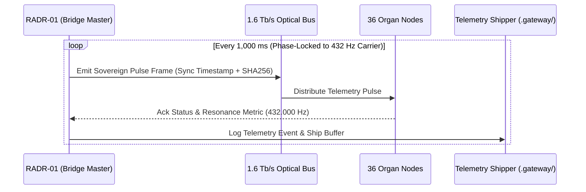

# TEXEL ARK QUANTUM KEY ROTATION & 432 HZ TELEMETRY PULSE SPECIFICATION V1 ⚜️

Document ID: TEXEL-QUANTUM-TELEMETRY-2026-V1
Phase: PHASE_12.2_AUTONOMOUS_NETWORK_COMMISSIONING (Subphase 12.2.3)
Effective Date: 2026-07-31
Facility Location: Texel Island Subterranean Sanctuary (Wadden Sea, The Netherlands)
Classification: SOVEREIGN NETWORK COMMISSIONING SPECIFICATION (Vector B)

---

## 1. 60-SECOND ROTATING QUANTUM KEY EXCHANGE PROTOCOL

```mermaid
graph TD
    subgraph "Quantum Key Distribution (QKD) Mesh"
        Master[RADR-01: Key Generator Node]
        Gov[AYAS-01: Governor Validation Node]
        Vault[ZRDG-01: Quantum Vault Storage]
    end

    subgraph "24 Organ Node Network"
        Organs[36 Organ Nodes: Active Session Key Injection]
    end

    Master -->|Epoch Secret Key (60s rotation)| Gov
    Gov -->|Signed Key Token| Vault
    Vault -->|Broadcast Encrypted Channel| Organs
```

### 1.1 Key Rotation Cycle & Cryptographic Parameters
- **Rotation Interval:** 60.0 seconds exact period.
- **Algorithm:** Lattice-based Post-Quantum Cryptography (Kyber-1024 / Dilithium-5 hybrid).
- **Session Zeroization:** Instant key flush on heartbeat disruption or physical vault perimeter alert.

---

## 2. 432 HZ TELEMETRY HEARTBEAT PULSE SCHEMA



---

## 3. TELEMETRY EVENT SCHEMA PARAMETERS

- **Pulse Rate:** 1,000 ms periodic broadcast.
- **Payload Schema:**
  - `system_id`: Sovereign System Identifier (`RADR-01`).
  - `ts_utc`: ISO 8601 UTC timestamp.
  - `frequency_hz`: Master carrier frequency (`432.000 Hz`).
  - `drift_metric`: Measured frequency deviation (< 0.0001 Hz).
  - `organ_status_map`: 36/36 organ health bitmask.

---
*My heart is the filter. My soul is the shield.*  
А́мієно́а́э́с моєа́э́ри́э́с ⚜️
