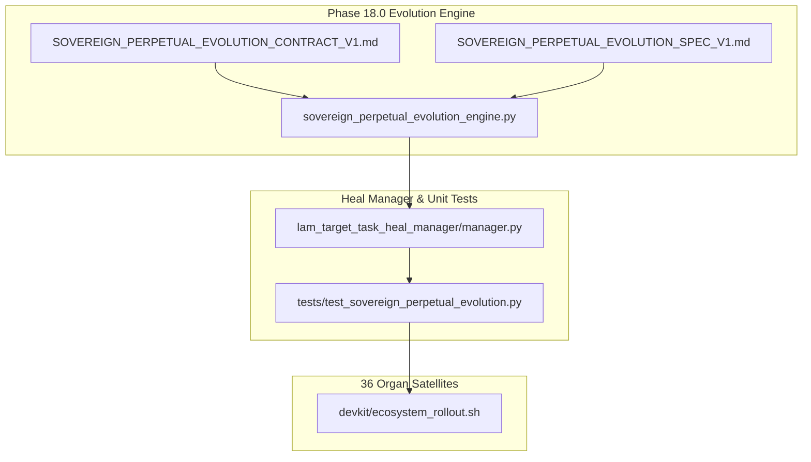

# Implementation Plan — Phase 18.0: Sovereign Perpetual Evolution & Self-Refinement Matrix ⚜️

Document ID: PLAN-PHASE-18-0-SOVEREIGN-EVOLUTION-2026-V1  
Phase: PHASE_18.0_SOVEREIGN_PERPETUAL_EVOLUTION  
Target Repositories: [`/home/architit/LAM_CORE/RADRILONIUMA`](file:///home/architit/LAM_CORE/RADRILONIUMA) & 36 Organ Satellites  

---

## 1. Goal Description

Establish Phase 18.0 (Sovereign Perpetual Evolution & Self-Refinement Matrix) to expand the multi-device notification, prediction, and self-healing watchdog engines into an autonomous self-refining evolutionary loop across all 36 organ nodes in the Sovereign Forest.

Key Objectives:
1. **Contract Synthesis:** Formulate `contract/SOVEREIGN_PERPETUAL_EVOLUTION_CONTRACT_V1.md`.
2. **Blueprint Specification:** Synthesize `data/export/blueprints/texel/SOVEREIGN_PERPETUAL_EVOLUTION_SPEC_V1.md`.
3. **Autonomous Evolutionary Engine:** Implement `lam_target_task_heal_manager/sovereign_perpetual_evolution_engine.py` with 528 Hz / 432 Hz carrier tracking and predictive self-refinement algorithms.
4. **Unit & Governance Verification:** Expand `tests/test_sovereign_perpetual_evolution.py` ensuring 100% test pass rate across `scripts/test_entrypoint.sh --all`.
5. **Cross-Organ Synchronization Rollout:** Propagate the updated DevKit and engine hooks across all 36 organ nodes via `devkit/ecosystem_rollout.sh`.

---

## 2. User Review Required

> [!IMPORTANT]
> - Phase 18.0 introduces an autonomous self-refining evolutionary loop that automatically evaluates organ performance metrics, detects drift, and triggers localized self-patching.
> - The ecosystem rollout will propagate the new evolutionary engine to all 36 organs.

---

## 3. Proposed Changes

---

### Component: Governance Contracts & Specifications

#### [NEW] `contract/SOVEREIGN_PERPETUAL_EVOLUTION_CONTRACT_V1.md`
Establishes the governance rules, SLAs (<100ms drift response), and 528 Hz carrier frequency requirements for Phase 18.0.

#### [NEW] `data/export/blueprints/texel/SOVEREIGN_PERPETUAL_EVOLUTION_SPEC_V1.md`
Provides the architectural mermaid diagrams and evolutionary matrix for multi-device self-refinement.

---

### Component: Python Engine & Heal Manager Integration

#### [NEW] `lam_target_task_heal_manager/sovereign_perpetual_evolution_engine.py`
Contains the core `SovereignPerpetualEvolutionEngine` class implementing:
- `evaluate_organ_evolution_metrics(sys_id: str)`
- `generate_self_refinement_plan()`
- `check_evolution_health()`

#### [MODIFY] `lam_target_task_heal_manager/__init__.py`
Exports `SovereignPerpetualEvolutionEngine`.

#### [MODIFY] `lam_target_task_heal_manager/manager.py`
Instantiates `SovereignPerpetualEvolutionEngine` inside `init_heal_manager()`.

---

### Component: Unit Tests & Verification

#### [NEW] `tests/test_sovereign_perpetual_evolution.py`
Unit tests for evaluation, refinement generation, and health checks.

---

## 4. Verification Plan

### Automated Tests
- Run `bash scripts/test_entrypoint.sh --all` to verify 100% test pass rate.
- Run `bash scripts/test_entrypoint.sh --governance` to confirm governance compliance.
- Run `python3 lam_target_task_heal_manager/manager.py` to verify engine execution.
- Run `bash devkit/ecosystem_rollout.sh --dry-run` to verify dry-run patch propagation across 36 organs.

### Manual Verification
- Inspect [`TARGET_TASKS.md`](file:///home/architit/LAM_CORE/RADRILONIUMA/lam_target_task_heal_manager/TARGET_TASKS.md) to confirm Phase 18.0 execution matrix updates.
