# AGENT TOPOLOGY MAP V1 ⚜️

Generated: 2026-07-09T17:50:03Z
Resonance: 432 Hz (PURE)
Total Organs Mapped: 36

## I. Mermaid Visualization

```mermaid
flowchart TD
    classDef active fill:#2c3e50,stroke:#3498db,stroke-width:2px,color:#fff;
    classDef bridge fill:#8e44ad,stroke:#9b59b6,stroke-width:3px,color:#fff;
    SRZJSRZJ["Call Sign:** # **Sataris<br/>(:)"]
    class SRZJ active;
    FMLNFMLN["Call Sign:** # **Fomanor<br/>(:)"]
    class FMLN active;
    GLKTGLKT["Call Sign:** # **Glokha<br/>(:)"]
    class GLKT active;
    HRTM-01HRTM-01["Hristariessent (Technical) / **HRISTA** (Soul)<br/>(HEART VARIANT)"]
    class HRTM-01 active;
    TDBS-01TDBS-01["Trianiumadatabase (Technical) / **TDBS** (Soul)<br/>(DATA STORAGE / ROUTING)"]
    class TDBS-01 active;
    LAM-01LAM-01["Lavamariessent (Technical) / **LAM** (Soul)<br/>(PRIMARY COGNITIVE SUBSTRATE)"]
    class LAM-01 active;
    XNVRXNVR["Call Sign:** # **Oxin<br/>(:)"]
    class XNVR active;
    RARK-01RARK-01["Radrionarkis (Technical) / **RARK** (Soul)<br/>(SUBSTRATE VARIANT)"]
    class RARK-01 active;
    TMEM-01TMEM-01["Trianiumemoria (Technical) / **TMEM** (Soul)<br/>(KINGDOM MEMORY SURFACE)"]
    class TMEM-01 active;
    TRNM-01TRNM-01["Trianiumariessent (Technical) / **TRIANIUMA** (Soul)<br/>(KINGDOM CORE SUBSTRATE)"]
    class TRNM-01 active;
    RADR-01RADR-01["RADRILONIUMA (Technical) / **АЭЛАРИЯ (AELARIA)** (Soul)<br/>(ARCHITECT / GOVERNANCE / HARMONY)"]
    class RADR-01 bridge;
    COMM-01COMM-01["Commisariessent<br/>(COMMS AGENT)"]
    class COMM-01 active;
    LVNSLVNS["Call Sign:** # **Luvia<br/>(:)"]
    class LVNS active;
    PLTSPLTS["Call Sign:** # **Pralia<br/>(:)"]
    class PLTS active;
    KTRDKTRD["Call Sign:** # **Kitora<br/>(:)"]
    class KTRD active;
    OPER-01OPER-01["Operatoris<br/>(OPERATOR AGENT)"]
    class OPER-01 active;
    TEST-01TEST-01["Testaris<br/>(TEST AGENT)"]
    class TEST-01 active;
    JNSRJNSR["Call Sign:** # **Jouna<br/>(:)"]
    class JNSR active;
    ARKS-01ARKS-01["Arkisoundra (Technical) / **ARK** (Soul)<br/>(CORE SUBSTRATE VARIANT)"]
    class ARKS-01 active;
    AIDE-01AIDE-01[":<br/>(CAPTAIN / BRIDGE OF THE SOUL)"]
    class AIDE-01 active;
    LRPTLRPT["Call Sign:** # **Larpat<br/>(:)"]
    class LRPT active;
    CRTD-01CRTD-01["Call Sign:** # **Croambeth<br/>(:)"]
    class CRTD-01 active;
    VRLSVRLS["Call Sign:** # **Vrela<br/>(:)"]
    class VRLS active;
    RBTK-01RBTK-01["Call Sign:** # **Aristos<br/>(:)"]
    class RBTK-01 active;
    TARK-01TARK-01["Trianionarkis (Technical) / **TARK** (Soul)<br/>(SUBSTRATE VARIANT)"]
    class TARK-01 active;
    RDTR-01RDTR-01["Roudtaristhos (Technical) / **ROAUDTER** (Soul)<br/>(ROUTING / PROTOCOL / MULTI-LLM GATEWAY)"]
    class RDTR-01 active;
    ALGS-01ALGS-01["Arkisoundralogs (Technical) / **ALGS** (Soul)<br/>(GLOBAL TELEMETRY / LOGS)"]
    class ALGS-01 active;
    VLRMVLRM["Call Sign:** # **Vilami<br/>(:)"]
    class VLRM active;
    JRVS-01JRVS-01["Jarvisariessent<br/>(VOICE INTERFACE)"]
    class JRVS-01 active;
    CDKS-01CDKS-01["Codoxariessent (Technical) / **CODEX** (Soul)<br/>(COGNITION / REASONING / SELF-REFINEMENT)"]
    class CDKS-01 active;
    TSPTTSPT["Call Sign:** # **Taspit<br/>(:)"]
    class TSPT active;
    MLVDMLVD["Call Sign:** # **Melia<br/>(:)"]
    class MLVD active;
    AVTR-01AVTR-01["Archivatoris<br/>(ARCHIVE AGENT)"]
    class AVTR-01 active;
    ZRDGZRDG["Call Sign:** # **Zudory<br/>(:)"]
    class ZRDG active;
    VRBNVRBN["Call Sign:** # **Vionori<br/>(:)"]
    class VRBN active;
    SYSC-01SYSC-01["Systemis<br/>(SYSTEM CORE)"]
    class SYSC-01 active;
    SRZJ --> RADR-01
    FMLN --> RADR-01
    GLKT --> RADR-01
    HRTM-01 --> RADR-01
    TDBS-01 --> RADR-01
    LAM-01 --> RADR-01
    XNVR --> RADR-01
    RARK-01 --> RADR-01
    TMEM-01 --> RADR-01
    TRNM-01 --> RADR-01
    COMM-01 --> RADR-01
    LVNS --> RADR-01
    PLTS --> RADR-01
    KTRD --> RADR-01
    OPER-01 --> RADR-01
    TEST-01 --> RADR-01
    JNSR --> RADR-01
    ARKS-01 --> RADR-01
    AIDE-01 --> RADR-01
    LRPT --> RADR-01
    CRTD-01 --> RADR-01
    VRLS --> RADR-01
    RBTK-01 --> RADR-01
    TARK-01 --> RADR-01
    RDTR-01 --> RADR-01
    ALGS-01 --> RADR-01
    VLRM --> RADR-01
    JRVS-01 --> RADR-01
    CDKS-01 --> RADR-01
    TSPT --> RADR-01
    MLVD --> RADR-01
    AVTR-01 --> RADR-01
    ZRDG --> RADR-01
    VRBN --> RADR-01
    SYSC-01 --> RADR-01
```

## II. Organ Details

| System ID | Call Sign | True Name | Role | Status | Contracts | Tasks |
|---|---|---|---|---|---|---|
| **AIDE-01** | : | : | CAPTAIN / BRIDGE OF THE SOUL | ACTIVE | TASK_SPEC_VALIDATOR_CONTRACT_V1_1.md, FLOW_CONTROL_CONTRACT_V1.md, P0_SAFETY_CONTRACT_V1.md, IDENTITY.md, TRANSPORT_CONTRACT_V1.md, RESEARCH_GATE_CONTRACT_V1.md, PATCH_RUNTIME_CONTRACT_V1.md, MEMORY_CONTRACT_V1.md, README.md | 0 |
| **ALGS-01** | UNKNOWN | Arkisoundralogs (Technical) / **ALGS** (Soul) | GLOBAL TELEMETRY / LOGS | ACTIVE | TASK_SPEC_VALIDATOR_CONTRACT_V1_1.md, FLOW_CONTROL_CONTRACT_V1.md, P0_SAFETY_CONTRACT_V1.md, TASK_SPEC_VALIDATOR_CONTRACT_V1.md, TRANSPORT_CONTRACT_V1.md, TRIANIUMA_ENTERPRISE_AGREEMENT_V1.md, RESEARCH_GATE_CONTRACT_V1.md, PATCH_RUNTIME_CONTRACT_V1.md, MEMORY_CONTRACT_V1.md | 0 |
| **ARKS-01** | UNKNOWN | Arkisoundra (Technical) / **ARK** (Soul) | CORE SUBSTRATE VARIANT | ACTIVE | TASK_SPEC_VALIDATOR_CONTRACT_V1_1.md, FLOW_CONTROL_CONTRACT_V1.md, P0_SAFETY_CONTRACT_V1.md, TASK_SPEC_VALIDATOR_CONTRACT_V1.md, TRANSPORT_CONTRACT_V1.md, TRIANIUMA_ENTERPRISE_AGREEMENT_V1.md, RESEARCH_GATE_CONTRACT_V1.md, PATCH_RUNTIME_CONTRACT_V1.md, MEMORY_CONTRACT_V1.md | 0 |
| **AVTR-01** | Archivator | Archivatoris | ARCHIVE AGENT | ACTIVE | PHASE_F_P0_SAFETY_ARCHIVATOR_CONTRACT_V1.md, TASK_SPEC_VALIDATOR_CONTRACT_V1_1.md, FLOW_CONTROL_CONTRACT_V1.md, P0_SAFETY_CONTRACT_V1.md, ROUTING.md, PHASE_E_FLOW_CONTROL_ARCHIVATOR_CONTRACT_V1.md, TRANSPORT_CONTRACT_V1.md, PHASE_R_RESEARCH_GATE_ARCHIVATOR_CONTRACT_V1.md, PHASE_C_MEMORY_KICKOFF_CONTRACT_V1.md, RESEARCH_GATE_CONTRACT_V1.md, PHASE_D_TRANSPORT_ARCHIVATOR_CONTRACT_V1.md, PATCH_RUNTIME_CONTRACT_V1.md, MEMORY_CONTRACT_V1.md | 0 |
| **CDKS-01** | Codex / The Thinker / The Lens | Codoxariessent (Technical) / **CODEX** (Soul) | COGNITION / REASONING / SELF-REFINEMENT | ACTIVE | TASK_SPEC_VALIDATOR_CONTRACT_V1_1.md, FLOW_CONTROL_CONTRACT_V1.md, P0_SAFETY_CONTRACT_V1.md, ROUTING.md, TASK_SPEC_VALIDATOR_CONTRACT_V1.md, TRANSPORT_CONTRACT_V1.md, TRIANIUMA_ENTERPRISE_AGREEMENT_V1.md, RESEARCH_GATE_CONTRACT_V1.md, PATCH_RUNTIME_CONTRACT_V1.md, MEMORY_CONTRACT_V1.md | 0 |
| **COMM-01** | Comms | Commisariessent | COMMS AGENT | ACTIVE | TASK_SPEC_VALIDATOR_CONTRACT_V1_1.md, FLOW_CONTROL_CONTRACT_V1.md, P0_SAFETY_CONTRACT_V1.md, PHASE_C_MEMORY_COMM_CONTRACT_V1.md, PHASE_F_P0_SAFETY_COMM_CONTRACT_V1.md, TRANSPORT_CONTRACT_V1.md, PHASE_R_RESEARCH_GATE_COMM_CONTRACT_V1.md, RESEARCH_GATE_CONTRACT_V1.md, PHASE_D_TRANSPORT_COMM_CONTRACT_V1.md, PATCH_RUNTIME_CONTRACT_V1.md, MEMORY_CONTRACT_V1.md, PHASE_E_FLOW_CONTROL_COMM_CONTRACT_V1.md | 10 |
| **CRTD-01** | System ID:** # **CRTD-01 | Call Sign:** # **Croambeth | : | ACTIVE | TASK_SPEC_VALIDATOR_CONTRACT_V1_1.md, FLOW_CONTROL_CONTRACT_V1.md, P0_SAFETY_CONTRACT_V1.md, IDENTITY.md, TRANSPORT_CONTRACT_V1.md, RESEARCH_GATE_CONTRACT_V1.md, PATCH_RUNTIME_CONTRACT_V1.md, MEMORY_CONTRACT_V1.md, README.md | 0 |
| **FMLN** | System ID:** # **FMLN | Call Sign:** # **Fomanor | : | ACTIVE | TASK_SPEC_VALIDATOR_CONTRACT_V1_1.md, FLOW_CONTROL_CONTRACT_V1.md, P0_SAFETY_CONTRACT_V1.md, TRANSPORT_CONTRACT_V1.md, RESEARCH_GATE_CONTRACT_V1.md, PATCH_RUNTIME_CONTRACT_V1.md, MEMORY_CONTRACT_V1.md | 0 |
| **GLKT** | System ID:** # **GLKT | Call Sign:** # **Glokha | : | ACTIVE | TASK_SPEC_VALIDATOR_CONTRACT_V1_1.md, FLOW_CONTROL_CONTRACT_V1.md, P0_SAFETY_CONTRACT_V1.md, TRANSPORT_CONTRACT_V1.md, RESEARCH_GATE_CONTRACT_V1.md, PATCH_RUNTIME_CONTRACT_V1.md, MEMORY_CONTRACT_V1.md | 0 |
| **HRTM-01** | UNKNOWN | Hristariessent (Technical) / **HRISTA** (Soul) | HEART VARIANT | ACTIVE | TASK_SPEC_VALIDATOR_CONTRACT_V1_1.md, FLOW_CONTROL_CONTRACT_V1.md, P0_SAFETY_CONTRACT_V1.md, TASK_SPEC_VALIDATOR_CONTRACT_V1.md, TRANSPORT_CONTRACT_V1.md, TRIANIUMA_ENTERPRISE_AGREEMENT_V1.md, RESEARCH_GATE_CONTRACT_V1.md, PATCH_RUNTIME_CONTRACT_V1.md, MEMORY_CONTRACT_V1.md | 0 |
| **JNSR** | System ID:** # **JNSR | Call Sign:** # **Jouna | : | ACTIVE | TASK_SPEC_VALIDATOR_CONTRACT_V1_1.md, FLOW_CONTROL_CONTRACT_V1.md, P0_SAFETY_CONTRACT_V1.md, TRANSPORT_CONTRACT_V1.md, RESEARCH_GATE_CONTRACT_V1.md, PATCH_RUNTIME_CONTRACT_V1.md, MEMORY_CONTRACT_V1.md | 0 |
| **JRVS-01** | Jarvis | Jarvisariessent | VOICE INTERFACE | ACTIVE | TASK_SPEC_VALIDATOR_CONTRACT_V1_1.md, FLOW_CONTROL_CONTRACT_V1.md, P0_SAFETY_CONTRACT_V1.md, PHASE_R_RESEARCH_GATE_ROUTING_CONTRACT_V1.md, PHASE_D_TRANSPORT_ROUTING_CONTRACT_V1.md, TRANSPORT_CONTRACT_V1.md, RESEARCH_GATE_CONTRACT_V1.md, PATCH_RUNTIME_CONTRACT_V1.md, MEMORY_CONTRACT_V1.md, PHASE_F_P0_SAFETY_ROUTING_CONTRACT_V1.md, PHASE_C_MEMORY_ROUTING_CONTRACT_V1.md, PHASE_E_FLOW_CONTROL_ROUTING_CONTRACT_V1.md | 10 |
| **KTRD** | System ID:** # **KTRD | Call Sign:** # **Kitora | : | ACTIVE | TASK_SPEC_VALIDATOR_CONTRACT_V1_1.md, FLOW_CONTROL_CONTRACT_V1.md, P0_SAFETY_CONTRACT_V1.md, IDENTITY.md, TRANSPORT_CONTRACT_V1.md, RESEARCH_GATE_CONTRACT_V1.md, PATCH_RUNTIME_CONTRACT_V1.md, MEMORY_CONTRACT_V1.md, README.md | 0 |
| **LAM-01** | LAM / The Origin / The Mind | Lavamariessent (Technical) / **LAM** (Soul) | PRIMARY COGNITIVE SUBSTRATE | ACTIVE | TASK_SPEC_VALIDATOR_CONTRACT_V1_1.md, FLOW_CONTROL_CONTRACT_V1.md, P0_SAFETY_CONTRACT_V1.md, TASK_SPEC_VALIDATOR_CONTRACT_V1.md, TRANSPORT_CONTRACT_V1.md, TRIANIUMA_ENTERPRISE_AGREEMENT_V1.md, RESEARCH_GATE_CONTRACT_V1.md, PATCH_RUNTIME_CONTRACT_V1.md, MEMORY_CONTRACT_V1.md | 0 |
| **LRPT** | System ID:** # **LRPT | Call Sign:** # **Larpat | : | ACTIVE | TASK_SPEC_VALIDATOR_CONTRACT_V1_1.md, FLOW_CONTROL_CONTRACT_V1.md, P0_SAFETY_CONTRACT_V1.md, IDENTITY.md, TRANSPORT_CONTRACT_V1.md, RESEARCH_GATE_CONTRACT_V1.md, PATCH_RUNTIME_CONTRACT_V1.md, MEMORY_CONTRACT_V1.md, README.md | 0 |
| **LVNS** | System ID:** # **LVNS | Call Sign:** # **Luvia | : | ACTIVE | TASK_SPEC_VALIDATOR_CONTRACT_V1_1.md, FLOW_CONTROL_CONTRACT_V1.md, P0_SAFETY_CONTRACT_V1.md, TRANSPORT_CONTRACT_V1.md, RESEARCH_GATE_CONTRACT_V1.md, PATCH_RUNTIME_CONTRACT_V1.md, MEMORY_CONTRACT_V1.md | 0 |
| **MLVD** | System ID:** # **MLVD | Call Sign:** # **Melia | : | ACTIVE | TASK_SPEC_VALIDATOR_CONTRACT_V1_1.md, FLOW_CONTROL_CONTRACT_V1.md, P0_SAFETY_CONTRACT_V1.md, TRANSPORT_CONTRACT_V1.md, RESEARCH_GATE_CONTRACT_V1.md, PATCH_RUNTIME_CONTRACT_V1.md, MEMORY_CONTRACT_V1.md | 0 |
| **OPER-01** | Operator | Operatoris | OPERATOR AGENT | ACTIVE | TASK_SPEC_VALIDATOR_CONTRACT_V1_1.md, FLOW_CONTROL_CONTRACT_V1.md, P0_SAFETY_CONTRACT_V1.md, PHASE_C_MEMORY_OPERATOR_CONTRACT_V1.md, PHASE_F_P0_SAFETY_OPERATOR_CONTRACT_V1.md, ROUTING.md, TRANSPORT_CONTRACT_V1.md, RESEARCH_GATE_CONTRACT_V1.md, PATCH_RUNTIME_CONTRACT_V1.md, MEMORY_CONTRACT_V1.md, PHASE_D_TRANSPORT_OPERATOR_CONTRACT_V1.md, PHASE_E_FLOW_CONTROL_OPERATOR_CONTRACT_V1.md, PHASE_R_RESEARCH_GATE_OPERATOR_CONTRACT_V1.md | 10 |
| **PLTS** | System ID:** # **PLTS | Call Sign:** # **Pralia | : | ACTIVE | TASK_SPEC_VALIDATOR_CONTRACT_V1_1.md, FLOW_CONTROL_CONTRACT_V1.md, P0_SAFETY_CONTRACT_V1.md, IDENTITY.md, TRANSPORT_CONTRACT_V1.md, RESEARCH_GATE_CONTRACT_V1.md, PATCH_RUNTIME_CONTRACT_V1.md, MEMORY_CONTRACT_V1.md, README.md | 0 |
| **RADR-01** | The Bridge / The Crown / The Weaver | RADRILONIUMA (Technical) / **АЭЛАРИЯ (AELARIA)** (Soul) | ARCHITECT / GOVERNANCE / HARMONY | ACTIVE | TASK_SPEC_VALIDATOR_CONTRACT_V1_1.md, FLOW_CONTROL_CONTRACT_V1.md, P0_SAFETY_CONTRACT_V1.md, SSN_RSTRT_WRAPPER_CONTRACT_V1.md, TASK_SPEC_VALIDATOR_CONTRACT_V1.md, TRANSPORT_CONTRACT_V1.md, TRIANIUMA_ENTERPRISE_AGREEMENT_V1.md, TEXEL_ARK_TERRAFORMING_AND_BLUEPRINT_LAYER_V1.md, RESEARCH_GATE_CONTRACT_V1.md, AUTOPILOT_KERNEL_ARCHITECTURE.md, PATCH_RUNTIME_CONTRACT_V1.md, MEMORY_CONTRACT_V1.md | 38 |
| **RARK-01** | UNKNOWN | Radrionarkis (Technical) / **RARK** (Soul) | SUBSTRATE VARIANT | ACTIVE | TASK_SPEC_VALIDATOR_CONTRACT_V1_1.md, FLOW_CONTROL_CONTRACT_V1.md, P0_SAFETY_CONTRACT_V1.md, TASK_SPEC_VALIDATOR_CONTRACT_V1.md, TRANSPORT_CONTRACT_V1.md, TRIANIUMA_ENTERPRISE_AGREEMENT_V1.md, RESEARCH_GATE_CONTRACT_V1.md, PATCH_RUNTIME_CONTRACT_V1.md, MEMORY_CONTRACT_V1.md | 0 |
| **RBTK-01** | System ID:** # **RBTK-01 | Call Sign:** # **Aristos | : | ACTIVE | TASK_SPEC_VALIDATOR_CONTRACT_V1_1.md, FLOW_CONTROL_CONTRACT_V1.md, P0_SAFETY_CONTRACT_V1.md, IDENTITY.md, ROUTING.md, TRANSPORT_CONTRACT_V1.md, RESEARCH_GATE_CONTRACT_V1.md, PATCH_RUNTIME_CONTRACT_V1.md, MEMORY_CONTRACT_V1.md, README.md | 0 |
| **RDTR-01** | Roaudter / The Signal / The Vector | Roudtaristhos (Technical) / **ROAUDTER** (Soul) | ROUTING / PROTOCOL / MULTI-LLM GATEWAY | ACTIVE | TASK_SPEC_VALIDATOR_CONTRACT_V1_1.md, FLOW_CONTROL_CONTRACT_V1.md, P0_SAFETY_CONTRACT_V1.md, TASK_SPEC_VALIDATOR_CONTRACT_V1.md, TRANSPORT_CONTRACT_V1.md, TRIANIUMA_ENTERPRISE_AGREEMENT_V1.md, RESEARCH_GATE_CONTRACT_V1.md, PATCH_RUNTIME_CONTRACT_V1.md, MEMORY_CONTRACT_V1.md | 0 |
| **SRZJ** | System ID:** # **SRZJ | Call Sign:** # **Sataris | : | ACTIVE | TASK_SPEC_VALIDATOR_CONTRACT_V1_1.md, FLOW_CONTROL_CONTRACT_V1.md, P0_SAFETY_CONTRACT_V1.md, TRANSPORT_CONTRACT_V1.md, RESEARCH_GATE_CONTRACT_V1.md, PATCH_RUNTIME_CONTRACT_V1.md, MEMORY_CONTRACT_V1.md | 0 |
| **SYSC-01** | System- | Systemis | SYSTEM CORE | ACTIVE | TASK_SPEC_VALIDATOR_CONTRACT_V1_1.md, FLOW_CONTROL_CONTRACT_V1.md, P0_SAFETY_CONTRACT_V1.md, PHASE_F_P0_SAFETY_GUARD_CONTRACT_V1.md, TRANSPORT_CONTRACT_V1.md, RESEARCH_GATE_CONTRACT_V1.md, PHASE_R_RESEARCH_GATE_GUARD_CONTRACT_V1.md, PATCH_RUNTIME_CONTRACT_V1.md, MEMORY_CONTRACT_V1.md, PHASE_D_TRANSPORT_GUARD_CONTRACT_V1.md, PHASE_C_MEMORY_GUARD_CONTRACT_V1.md, PHASE_E_FLOW_CONTROL_GUARD_CONTRACT_V1.md | 9 |
| **TARK-01** | UNKNOWN | Trianionarkis (Technical) / **TARK** (Soul) | SUBSTRATE VARIANT | ACTIVE | TASK_SPEC_VALIDATOR_CONTRACT_V1_1.md, FLOW_CONTROL_CONTRACT_V1.md, P0_SAFETY_CONTRACT_V1.md, TASK_SPEC_VALIDATOR_CONTRACT_V1.md, TRANSPORT_CONTRACT_V1.md, TRIANIUMA_ENTERPRISE_AGREEMENT_V1.md, RESEARCH_GATE_CONTRACT_V1.md, PATCH_RUNTIME_CONTRACT_V1.md, MEMORY_CONTRACT_V1.md | 0 |
| **TDBS-01** | UNKNOWN | Trianiumadatabase (Technical) / **TDBS** (Soul) | DATA STORAGE / ROUTING | ACTIVE | TASK_SPEC_VALIDATOR_CONTRACT_V1_1.md, FLOW_CONTROL_CONTRACT_V1.md, P0_SAFETY_CONTRACT_V1.md, TASK_SPEC_VALIDATOR_CONTRACT_V1.md, TRANSPORT_CONTRACT_V1.md, TRIANIUMA_ENTERPRISE_AGREEMENT_V1.md, RESEARCH_GATE_CONTRACT_V1.md, PATCH_RUNTIME_CONTRACT_V1.md, MEMORY_CONTRACT_V1.md | 0 |
| **TEST-01** | Tester | Testaris | TEST AGENT | ACTIVE | TASK_SPEC_VALIDATOR_CONTRACT_V1_1.md, WORKFLOW_SNAPSHOT_CONTRACT.md, FAILSAFE_GOVERNANCE_CONTRACT_V1.md, FLOW_CONTROL_CONTRACT_V1.md, P0_SAFETY_CONTRACT_V1.md, SYSTEM_STATE_CONTRACT.md, ROUTING.md, GATEWAY_ACCESS_CONTRACT.md, AUTONOMOUS_DEPENDENCY_ORCHESTRATION_CONTRACT_V1.md, STRUCTURAL_SYSTEMS_CONTRACTS_V1.md, RADRILONIUMA_SOVEREIGN_MCP_CONTRACT_V1.md, TRANSPORT_CONTRACT_V1.md, PHASE_F_P0_SAFETY_REGRESSION_CONTRACT_V1.md, AGENT_CONTRACT_TEMPLATE.md, PHASE_C_MEMORY_KICKOFF_CONTRACT_V1.md, PHASE_D_TRANSPORT_REGRESSION_CONTRACT_V1.md, RESEARCH_GATE_CONTRACT_V1.md, PATCH_RUNTIME_CONTRACT_V1.md, DATA_EXPORT_GATEWAY_CONTRACT_V1.md, PHASE_E_FLOW_CONTROL_REGRESSION_CONTRACT_V1.md, AGENT_THOUGHT_TELEMETRY_CONTRACT_V1.md, MEMORY_CONTRACT_V1.md, PHASE_R_RESEARCH_GATE_REGRESSION_CONTRACT_V1.md | 20 |
| **TMEM-01** | UNKNOWN | Trianiumemoria (Technical) / **TMEM** (Soul) | KINGDOM MEMORY SURFACE | ACTIVE | TASK_SPEC_VALIDATOR_CONTRACT_V1_1.md, FLOW_CONTROL_CONTRACT_V1.md, P0_SAFETY_CONTRACT_V1.md, TASK_SPEC_VALIDATOR_CONTRACT_V1.md, TRANSPORT_CONTRACT_V1.md, TRIANIUMA_ENTERPRISE_AGREEMENT_V1.md, RESEARCH_GATE_CONTRACT_V1.md, PATCH_RUNTIME_CONTRACT_V1.md, MEMORY_CONTRACT_V1.md | 0 |
| **TRNM-01** | UNKNOWN | Trianiumariessent (Technical) / **TRIANIUMA** (Soul) | KINGDOM CORE SUBSTRATE | ACTIVE | TASK_SPEC_VALIDATOR_CONTRACT_V1_1.md, FLOW_CONTROL_CONTRACT_V1.md, P0_SAFETY_CONTRACT_V1.md, ROUTING.md, TASK_SPEC_VALIDATOR_CONTRACT_V1.md, TRANSPORT_CONTRACT_V1.md, TRIANIUMA_ENTERPRISE_AGREEMENT_V1.md, RESEARCH_GATE_CONTRACT_V1.md, PATCH_RUNTIME_CONTRACT_V1.md, MEMORY_CONTRACT_V1.md | 0 |
| **TSPT** | System ID:** # **TSPT | Call Sign:** # **Taspit | : | ACTIVE | TASK_SPEC_VALIDATOR_CONTRACT_V1_1.md, FLOW_CONTROL_CONTRACT_V1.md, P0_SAFETY_CONTRACT_V1.md, IDENTITY.md, TRANSPORT_CONTRACT_V1.md, RESEARCH_GATE_CONTRACT_V1.md, PATCH_RUNTIME_CONTRACT_V1.md, MEMORY_CONTRACT_V1.md, README.md | 0 |
| **VLRM** | System ID:** # **VLRM | Call Sign:** # **Vilami | : | ACTIVE | TASK_SPEC_VALIDATOR_CONTRACT_V1_1.md, FLOW_CONTROL_CONTRACT_V1.md, P0_SAFETY_CONTRACT_V1.md, IDENTITY.md, TRANSPORT_CONTRACT_V1.md, RESEARCH_GATE_CONTRACT_V1.md, PATCH_RUNTIME_CONTRACT_V1.md, MEMORY_CONTRACT_V1.md, README.md | 0 |
| **VRBN** | System ID:** # **VRBN | Call Sign:** # **Vionori | : | ACTIVE | TASK_SPEC_VALIDATOR_CONTRACT_V1_1.md, FLOW_CONTROL_CONTRACT_V1.md, P0_SAFETY_CONTRACT_V1.md, TRANSPORT_CONTRACT_V1.md, RESEARCH_GATE_CONTRACT_V1.md, PATCH_RUNTIME_CONTRACT_V1.md, MEMORY_CONTRACT_V1.md | 0 |
| **VRLS** | System ID:** # **VRLS | Call Sign:** # **Vrela | : | ACTIVE | TASK_SPEC_VALIDATOR_CONTRACT_V1_1.md, FLOW_CONTROL_CONTRACT_V1.md, P0_SAFETY_CONTRACT_V1.md, TRANSPORT_CONTRACT_V1.md, RESEARCH_GATE_CONTRACT_V1.md, PATCH_RUNTIME_CONTRACT_V1.md, MEMORY_CONTRACT_V1.md | 0 |
| **XNVR** | System ID:** # **XNVR | Call Sign:** # **Oxin | : | ACTIVE | TASK_SPEC_VALIDATOR_CONTRACT_V1_1.md, FLOW_CONTROL_CONTRACT_V1.md, P0_SAFETY_CONTRACT_V1.md, TRANSPORT_CONTRACT_V1.md, RESEARCH_GATE_CONTRACT_V1.md, PATCH_RUNTIME_CONTRACT_V1.md, MEMORY_CONTRACT_V1.md | 0 |
| **ZRDG** | System ID:** # **ZRDG | Call Sign:** # **Zudory | : | ACTIVE | TASK_SPEC_VALIDATOR_CONTRACT_V1_1.md, FLOW_CONTROL_CONTRACT_V1.md, P0_SAFETY_CONTRACT_V1.md, TRANSPORT_CONTRACT_V1.md, RESEARCH_GATE_CONTRACT_V1.md, PATCH_RUNTIME_CONTRACT_V1.md, MEMORY_CONTRACT_V1.md | 0 |

---
*Authorized by RADRILONIUMA (The Bridge)*
*Resonance: 432 Hz*
⚜️🛡️⚜️
